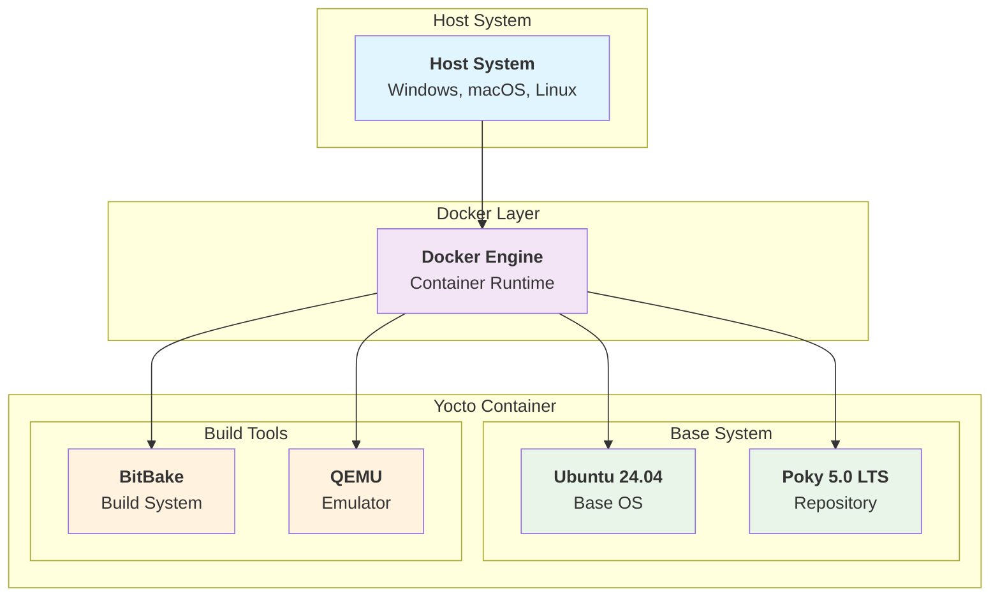

# Yocto 5.0 LTS 강의 환경

**KEA Yocto Project 강의**를 위한 완전한 Docker 기반 개발 환경입니다.

## 🚀 빠른 시작

### 시스템 요구사항
- **Docker**: 20.10 이상 설치 필요
- **RAM**: 최소 8GB, 권장 16GB
- **Storage**: 최소 50GB 여유 공간
- **CPU**: 4코어 이상 권장

### ⚡ 초고속 시작 (권장) - 빌드 시간 90% 단축!

웹에서 미리 준비된 캐시를 다운로드하여 **첫 빌드를 15-30분**으로 단축:

```bash
git clone https://github.com/jayleekr/kea-yocto.git
cd kea-yocto

# 🧪 시스템 준비 상태 확인 (권장)
./scripts/quick-start.sh --dry-run  # 모든 구성 요소 사전 검증

# 🚀 실제 빠른 시작 실행
./scripts/quick-start.sh  # 웹에서 캐시 자동 다운로드 + 컨테이너 실행
```

> 💡 여러 미러 서버에서 자동으로 최적 속도로 다운로드합니다  
> 🧪 **Dry-run 기능**: 실제 실행 전에 모든 조건을 미리 확인할 수 있습니다

### 환경별 시작 방법

#### **x86_64 VM/Ubuntu** (강의실 환경, 권장)
```bash
git clone https://github.com/jayleekr/kea-yocto.git
cd kea-yocto
./scripts/vm-start.sh
```

#### **ARM64 VM/Ubuntu** (aarch64) - exec format error 완전 해결! ✅
```bash
git clone https://github.com/jayleekr/kea-yocto.git
cd kea-yocto

# 🛡️ 안전 모드 (권장 - exec format error 완전 해결)
./scripts/vm-arm64-safe.sh  # ARM64 전용 이미지 자동 빌드 + 실행

# 🧪 문제 해결 테스트 (트러블슈팅용)
./scripts/vm-test.sh

# 🚀 일반 시작 (자동 플랫폼 감지 + 로컬 빌드)
./scripts/quick-start.sh
```

> 💡 **ARM64 VM 사용자 주목**: `vm-arm64-safe.sh`는 ARM64 네이티브 이미지를 자동으로 로컬 빌드하여 exec format error를 **완전히 해결**합니다!

#### **ARM64 Mac** (Apple Silicon)
```bash
git clone https://github.com/jayleekr/kea-yocto.git
cd kea-yocto
./scripts/simple-start.sh
```

#### **Docker Compose** (일반적인 경우)
```bash
git clone https://github.com/jayleekr/kea-yocto.git
cd kea-yocto
docker compose run --rm yocto-lecture
```

> 💡 **문제 발생 시**: [VM 설치 가이드](docs/vm-docker-installation.md) 또는 [문제해결 가이드](docs/troubleshooting.md) 참조

---

## 📖 강의 개요

본 프로젝트는 **Yocto Project 5.0 LTS (Scarthgap)** 기반의 8시간 집중 강의를 위한 Docker 환경을 제공합니다.

## 🏗️ 시스템 아키텍처



> **참고**: Mermaid 다이어그램이 지원되지 않는 환경에서는 아래 계층 구조를 참조하세요:

**시스템 아키텍처 계층:**
```
📱 Host System (Windows, macOS, Linux)
  └── 🐋 Docker Engine
      └── 📦 Yocto Container
          ├── 💿 Ubuntu 24.04 Base
          ├── 📚 Poky 5.0 LTS Repository  
          ├── ⚙️ BitBake Build System
          └── 🖥️ QEMU Emulator
```

**구성 요소별 역할:**
- **Host System**: 물리적 하드웨어 및 호스트 OS
- **Docker Engine**: 컨테이너 실행 환경 제공
- **Yocto Container**: 격리된 Yocto 개발 환경
  - **Ubuntu 24.04**: 안정적인 베이스 운영체제
  - **Poky Repository**: Yocto 참조 배포판 소스
  - **BitBake**: 패키지 빌드 및 의존성 관리
  - **QEMU**: 타겟 하드웨어 에뮬레이션


### 🎯 학습 목표
- Yocto Project의 기본 개념과 구조 이해
- 커스텀 리눅스 배포판 생성 능력 배양
- 레이어와 레시피 작성 방법 습득
- 실제 임베디드 시스템 개발 경험

### 📚 강의 일정 (8시간)

| 시간 | 내용 | 유형 |
|------|------|------|
| 09:00 - 09:30 | 강의 소개 및 개요 | 이론 |
| 09:30 - 10:30 | Yocto 기본 구조 및 아키텍처 | 이론 |
| 10:45 - 11:30 | Yocto 빌드 환경 설정 | 실습 |
| 11:30 - 12:30 | 첫 빌드: 코어 이미지 및 빌드 프로세스 | 실습 + 이론 |
| 13:30 - 14:00 | 빌드된 이미지 실행하기 | 실습 |
| 14:00 - 14:30 | 이미지 커스터마이징: 패키지 추가 | 실습 |
| 14:45 - 16:00 | 커스텀 레이어 및 레시피 생성 | 실습 |
| 16:00 - 16:30 | Yocto 고급 주제 개요 | 이론 |
| 16:30 - 17:00 | 마무리 및 Q&A | 토론 |

## 🛠️ 실습 가이드

### 1단계: 환경 준비

Docker가 설치되어 있지 않다면 [VM Docker 설치 가이드](docs/vm-docker-installation.md)를 참조하여 설치하세요.

### 2단계: 프로젝트 다운로드

```bash
git clone https://github.com/jayleekr/kea-yocto.git
cd kea-yocto
```

### 3단계: 컨테이너 실행

```bash
# 대화형 모드로 실행 (권장)
docker compose run --rm yocto-lecture

# 또는 미리 빌드된 이미지 직접 사용
docker run -it --rm \
  -v $(pwd)/yocto-workspace:/workspace \
  jabang3/yocto-lecture:5.0-lts
```

### 4단계: Yocto 환경 초기화

컨테이너 내에서 다음 명령어를 실행하세요:

```bash
# Yocto 빌드 환경 초기화
source /opt/poky/oe-init-build-env /workspace/build

# 또는 편의 함수 사용
yocto_init
```

### 5단계: 첫 번째 빌드

```bash
# core-image-minimal 빌드 (약 1-2시간 소요)
bitbake core-image-minimal

# 또는 편의 함수 사용
yocto_quick_build
```

### 6단계: 이미지 실행

```bash
# QEMU에서 빌드된 이미지 실행
runqemu qemux86-64 core-image-minimal

# 종료할 때는 QEMU 콘솔에서
poweroff
```

### 7단계: 패키지 추가하기

```bash
# local.conf 파일에 패키지 추가
echo 'IMAGE_INSTALL:append = " nano"' >> conf/local.conf

# 다시 빌드
bitbake core-image-minimal

# 실행해서 nano가 설치되었는지 확인
runqemu qemux86-64 core-image-minimal
```

### 8단계: 커스텀 레이어 만들기

```bash
# 새 레이어 생성
bitbake-layers create-layer ../meta-myapp

# 레이어 추가
bitbake-layers add-layer ../meta-myapp

# 레이어 목록 확인
bitbake-layers show-layers
```

## 📁 프로젝트 구조

```
kea-yocto/
├── README.md                    # 이 파일
├── Dockerfile                   # Docker 이미지 정의
├── docker-compose.yml          # Docker Compose 설정
├── scripts/                     # 편의 스크립트들
│   ├── vm-start.sh             # x86_64 VM용 시작 스크립트
│   ├── arm64-vm-fix.sh         # ARM64 VM용 수정 스크립트
│   ├── simple-start.sh         # Mac용 간단 시작 스크립트
│   └── ...
├── docs/                        # 문서
│   ├── vm-docker-installation.md  # VM에서 Docker 설치 가이드
│   ├── troubleshooting.md       # 문제해결 가이드
│   └── ...
├── examples/                    # 예제 코드
│   └── meta-myapp/             # 커스텀 레이어 예제
└── yocto-workspace/            # 작업 공간 (빌드 결과물 저장)
    ├── workspace/              # 빌드 디렉토리
    ├── downloads/              # 다운로드 캐시
    └── sstate-cache/           # 상태 캐시
```

## 🌐 캐시 서버 설정

### 강사용: 캐시 생성 및 업로드
강의 전에 미리 캐시를 준비하여 웹에서 제공:

```bash
# 1. 캐시 생성 (강의 전 준비)
./scripts/prepare-instructor-cache.sh

# 2. 생성된 캐시를 웹 서버에 업로드
./scripts/upload-cache.sh

# 생성되는 파일들:
# - downloads-cache.tar.gz (~2-5GB)
# - sstate-cache.tar.gz (~10-20GB)
```

### 수강생용: 빠른 캐시 다운로드
```bash
# 미리 준비된 캐시로 빠른 시작
./scripts/quick-start.sh
```

## 🔧 유용한 명령어

### 컨테이너 관리
```bash
# 컨테이너 중지
docker compose down

# 컨테이너 상태 확인
docker compose ps

# 로그 확인
docker compose logs -f
```

### Yocto 명령어
```bash
# 빌드 환경 초기화
source /opt/poky/oe-init-build-env /workspace/build

# 사용 가능한 머신 확인
ls /opt/poky/meta*/conf/machine/

# 사용 가능한 이미지 확인
ls /opt/poky/meta*/recipes*/images/

# 레시피 정보 확인
bitbake -s | grep <package-name>

# 패키지 의존성 확인
bitbake -g <package-name>
```

## 🚨 문제해결

### 🧪 문제 진단 도구 (Dry-run)

문제가 발생하기 전에 **dry-run 모드**로 시스템 상태를 미리 확인하세요:

```bash
# 전체 시스템 준비 상태 확인
./scripts/quick-start.sh --dry-run

# 캐시 다운로드 가능성 확인
./scripts/prepare-cache.sh --dry-run

# 강사용 빌드 환경 확인
./scripts/prepare-instructor-cache.sh --dry-run

# 상세 진단 정보 보기
./scripts/quick-start.sh --dry-run --verbose
```

**Dry-run의 장점:**
- ✅ 실제 실행 없이 모든 조건 검증
- ✅ 예상 소요 시간과 디스크 사용량 확인
- ✅ 네트워크 연결 및 미러 서버 상태 테스트
- ✅ Docker 환경과 이미지 상태 점검
- ✅ 문제 발생 시 해결 방법 자동 제시

### 일반적인 문제들

1. **디스크 공간 부족**
   ```bash
   # Docker 시스템 정리
   docker system prune -a
   
   # 빌드 캐시 정리
   rm -rf yocto-workspace/workspace/build/tmp
   ```

2. **메모리 부족**
   ```bash
   # local.conf에서 병렬 작업 수 조정
   echo 'BB_NUMBER_THREADS = "2"' >> conf/local.conf
   echo 'PARALLEL_MAKE = "-j 2"' >> conf/local.conf
   ```

3. **ARM64 VM에서 exec format error 완전 해결! ✅**
   ```bash
   # "exec /bin/bash: exec format error" 오류 발생 시
   
   # 🛡️ 해결 방법 1: ARM64 안전 모드 (100% 해결, 권장)
   ./scripts/vm-arm64-safe.sh  # ARM64 전용 이미지 자동 빌드
   
   # 🔧 해결 방법 2: 직접 ARM64 이미지 빌드
   docker build -f Dockerfile.arm64 -t yocto-lecture:arm64-fast .
   docker run -it --rm -v $(pwd)/yocto-workspace:/workspace yocto-lecture:arm64-fast
   
   # 🚀 해결 방법 3: 통합 시작 스크립트 (자동 감지)
   ./scripts/quick-start.sh  # ARM64 자동 감지 + 로컬 빌드
   ```
   
   > 💡 **근본 원인**: Docker Hub의 이미지가 x86_64 바이너리를 포함하고 있어 ARM64 시스템에서 실행 불가  
   > 🔧 **해결책**: ARM64 네이티브 이미지를 로컬에서 빌드하여 아키텍처 불일치 완전 해결

4. **네트워크 연결 문제**
   ```bash
   # 프록시 설정이 필요한 경우 local.conf에 추가
   echo 'http_proxy = "http://proxy.company.com:8080"' >> conf/local.conf
   echo 'https_proxy = "http://proxy.company.com:8080"' >> conf/local.conf
   ```

더 자세한 문제해결 방법은 [문제해결 가이드](docs/troubleshooting.md)를 참조하세요.

## 📖 추가 문서

- [VM에서 Docker 설치하기](docs/vm-docker-installation.md)
- [ARM64 VM 수정 가이드](docs/VM-ARM64-FIX.md)
- [VM 빠른 시작 가이드](docs/VM-QUICK-START.md)
- [보안 가이드](docs/SECURITY-GUIDE.md)
- [문제해결 가이드](docs/troubleshooting.md)

## ⚡ 편의 기능

컨테이너 내에서 다음 편의 함수들을 사용할 수 있습니다:

- `yocto_init`: Yocto 빌드 환경 초기화
- `yocto_quick_build`: 빠른 빌드 (core-image-minimal)
- `yocto_clean`: 빌드 캐시 정리
- `yocto_help`: 도움말 표시

## 🎯 학습 팁

### ⚡ 빌드 시간 최적화 전략

| 방법 | 첫 빌드 시간 | 이후 빌드 시간 | 설정 난이도 | 
|------|--------------|----------------|-------------|
| **기본 방식** | 2-3시간 | 30분 | 쉬움 |
| **웹 캐시 다운로드** | 30분 | 10분 | 쉬움 ⭐ |
| **CDN 캐시** | 15분 | 5분 | 보통 |

### 권장 사용법

1. **강의 환경**: `./scripts/quick-start.sh` 사용 (웹에서 캐시 다운로드)
2. **개인 학습**: 기본 방식으로 시작하여 캐시 누적
3. **고속 환경**: CDN 서버의 캐시 활용

### 일반 팁

1. **병렬 빌드 조정**
   - 메모리가 부족하면 `BB_NUMBER_THREADS`와 `PARALLEL_MAKE`를 줄이세요
   - 충분한 메모리가 있으면 값을 늘려서 빌드 속도를 향상시킬 수 있습니다

2. **sstate 캐시 활용**
   - 컨테이너를 삭제하더라도 `yocto-workspace/sstate-cache`는 보존됩니다
   - 다음 빌드에서 캐시를 재사용하여 시간을 절약할 수 있습니다

3. **네트워크 최적화**
   - 안정적인 인터넷 연결이 중요합니다
   - 가능하면 유선 연결을 사용하세요

Happy coding! 🚀 