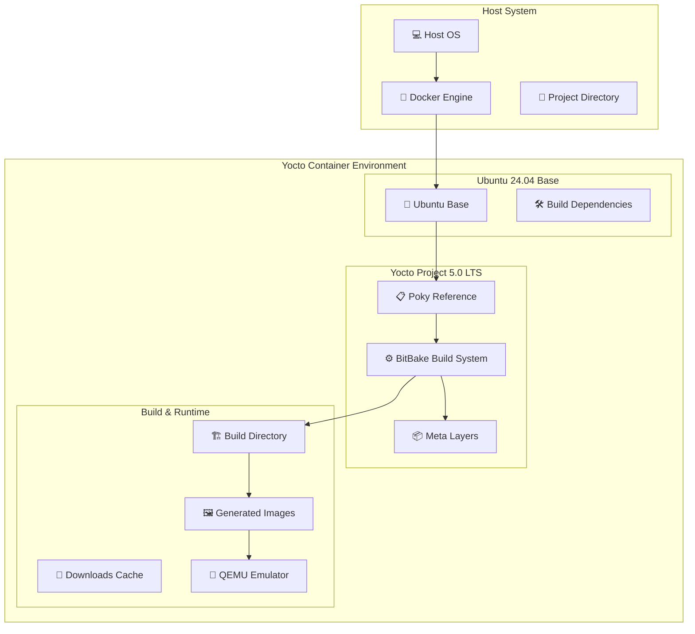
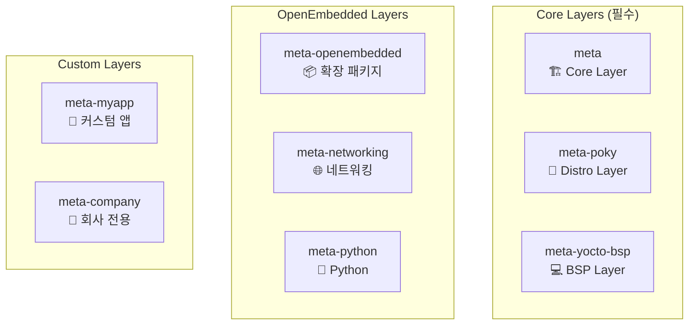
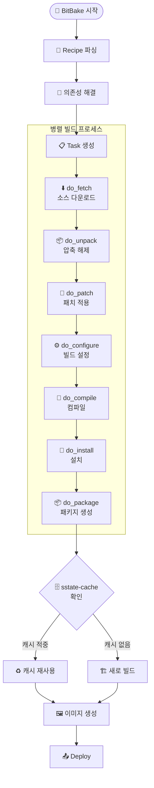
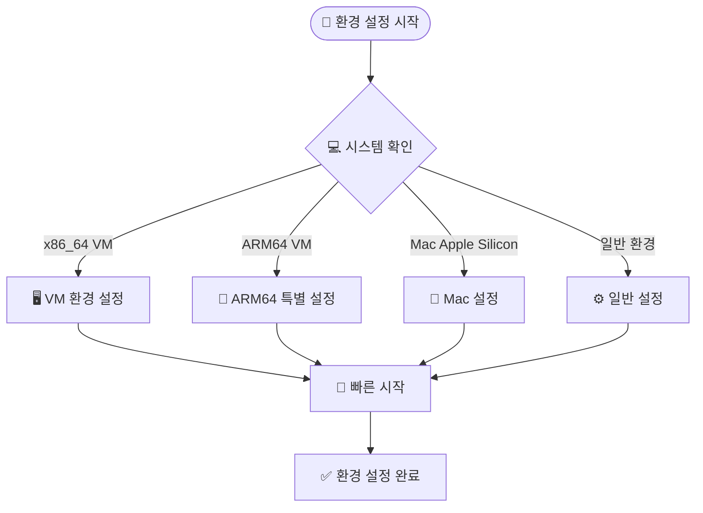
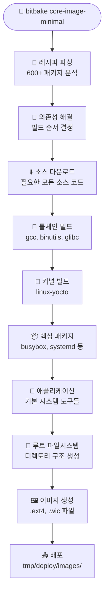

# KEA Yocto Project 5.0 LTS 강의 - 전체 문서
이 문서는 모든 강의 내용을 하나로 합친 통합 문서입니다.

---

# KEA Yocto Project 5.0 LTS 강의

<div class="hero-section">
  <div class="hero-icon">🏗️</div>
  <h2 class="hero-title">Yocto Project</h2>
  <p class="hero-subtitle"><strong>Custom Linux Distribution Builder</strong></p>
</div>

!!! info "강의 정보"
    - **강의명**: Yocto Project를 활용한 임베디드 리눅스 시스템 개발  
    - **대상**: 임베디드 시스템 개발자, 리눅스 시스템 엔지니어  
    - **시간**: 8시간 (휴식 포함)  
    - **환경**: Docker 기반 Yocto 5.0 LTS (Scarthgap)  

---

## 🎯 강의 목표

!!! info "학습 목표"
    이 강의를 통해 다음을 학습합니다:

    ✅ Yocto Project의 기본 개념과 아키텍처 이해  
    ✅ Docker 환경에서 Yocto 빌드 환경 구축  
    ✅ 커스텀 리눅스 이미지 생성 및 실행  
    ✅ 패키지 추가 및 이미지 커스터마이징  
    ✅ 커스텀 레이어와 레시피 작성  
    ✅ 실제 프로젝트 적용 가능한 실무 지식 습득  

## 📋 강의 목차

| 시간 | 내용 | 유형 | 비고 |
|------|------|------|------|
| 09:00-09:30 | [강의 소개 및 개요](lecture/intro.md) | 이론 | 30분 |
| 09:30-10:30 | [Yocto 기본 구조 및 아키텍처](lecture/architecture.md) | 이론 | 60분 |
| 10:45-11:30 | [Yocto 빌드 환경 설정](lecture/setup.md) | 실습 | 45분 |
| 11:30-12:30 | [첫 빌드: 코어 이미지 및 빌드 프로세스](lecture/first-build.md) | 실습+이론 | 60분 |
| 13:30-14:00 | [빌드된 이미지 실행하기](lecture/run-image.md) | 실습 | 30분 |
| 14:00-14:30 | [이미지 커스터마이징: 패키지 추가](lecture/customize.md) | 실습 | 30분 |
| 14:45-16:00 | [커스텀 레이어 및 레시피 생성](lecture/custom-layer.md) | 실습 | 75분 |
| 16:00-16:30 | [Yocto 고급 주제 개요](lecture/advanced.md) | 이론 | 30분 |
| 16:30-17:00 | [마무리 및 Q&A](lecture/conclusion.md) | 토론 | 30분 |

## 🚀 빠른 시작

!!! tip "실습 환경 준비"
    ```bash
    # 프로젝트 클론
    git clone https://github.com/jayleekr/kea-yocto.git
    cd kea-yocto
    
    # Docker 환경 시작
    ./scripts/quick-start.sh
    ```

## 📚 주요 특징

=== "🐋 Docker 기반"
    - 일관된 개발 환경 제공
    - 호스트 시스템 영향 최소화
    - 빠른 환경 구축

=== "⚡ 최적화된 빌드"
    - 웹 캐시 활용으로 빌드 시간 단축
    - 효율적인 리소스 사용
    - 병렬 빌드 지원

=== "🎓 실습 중심"
    - 단계별 실습 가이드
    - 실제 사용 사례 기반
    - 문제 해결 중심 학습

## 🔗 유용한 링크

- [Yocto Project 공식 문서](https://docs.yoctoproject.org/5.0/)
- [OpenEmbedded Layer Index](https://layers.openembedded.org/)
- [BitBake 사용자 매뉴얼](https://docs.yoctoproject.org/bitbake/)
- [Yocto Project Quick Build](https://docs.yoctoproject.org/brief-yoctoprojectqs/)

---

!!! warning "시스템 요구사항"
    - **CPU**: 4코어 이상
    - **RAM**: 8GB (권장 16GB)
    - **Storage**: 50GB 여유 공간
    - **Docker**: 20.10 이상 


---

<div style='page-break-before: always;'></div>

# 1. Yocto Project 소개

# 강의 소개 및 개요

## Yocto Project란?

**Yocto Project**는 임베디드 리눅스 배포판을 만들기 위한 오픈소스 프로젝트입니다.

### 핵심 특징

!!! note "Yocto Project 주요 특징"
    - 📦 **커스텀 리눅스 배포판** 생성
    - 🔧 **크로스 컴파일 툴체인** 자동 생성
    - 📚 **레시피 기반** 패키지 관리
    - 🎯 **타겟 하드웨어** 최적화

### 주요 구성 요소

=== "Poky"
    **Yocto의 참조 배포판**
    
    - Yocto Project의 기본 구현체
    - 최소한의 Linux 시스템 구축을 위한 기본 설정
    - 다른 배포판의 기준점 역할

=== "BitBake"
    **빌드 도구 및 태스크 실행기**
    
    - Python과 shell 기반의 빌드 시스템
    - 의존성 기반 병렬 빌드 지원
    - 태스크 스케줄링 및 실행 관리

=== "OpenEmbedded"
    **메타데이터 및 레시피 저장소**
    
    - 패키지 빌드를 위한 메타데이터 제공
    - 레시피(.bb), 클래스(.bbclass) 파일 관리
    - 크로스 플랫폼 빌드 지원

## 강의 목표

!!! success "이 강의를 통해 학습할 내용"
    ✅ Yocto Project의 기본 개념과 아키텍처 이해  
    ✅ Docker 환경에서 Yocto 빌드 환경 구축  
    ✅ 커스텀 리눅스 이미지 생성 및 실행  
    ✅ 패키지 추가 및 이미지 커스터마이징  
    ✅ 커스텀 레이어와 레시피 작성  
    ✅ 실제 프로젝트 적용 가능한 실무 지식 습득  

## 전통적인 배포판 vs Yocto Project

| 구분 | 전통적인 배포판 | Yocto Project |
|------|----------------|---------------|
| **접근 방법** | 미리 빌드된 패키지 | 소스에서 빌드 |
| **패키지 관리** | APT, YUM 등 | 레시피 기반 |
| **커스터마이징** | 제한적 | 완전한 제어 |
| **크기 최적화** | 어려움 | 필요한 것만 포함 |
| **크로스 컴파일** | 복잡함 | 자동 지원 |

!!! tip "왜 Yocto를 사용하는가?"
    - **완전한 제어**: 시스템의 모든 구성 요소를 직접 제어
    - **최적화**: 타겟 하드웨어에 최적화된 시스템 구축
    - **보안**: 불필요한 패키지 제거로 공격 표면 최소화
    - **라이선스 관리**: 명확한 라이선스 추적 및 관리

## 학습 전 준비사항

### 필요한 기본 지식

!!! info "권장 배경 지식"
    - **Linux 시스템 기본 지식**
    - **터미널/명령줄 사용 경험**
    - **기본적인 C/C++ 프로그래밍 이해**
    - **Makefile 및 빌드 시스템 개념**

### 실습 환경

!!! warning "시스템 요구사항"
    - **CPU**: 4코어 이상 (권장: 8코어)
    - **RAM**: 8GB 이상 (권장: 16GB)
    - **Storage**: 50GB 여유 공간
    - **Docker**: 20.10 이상
    - **네트워크**: 안정적인 인터넷 연결

## 강의 진행 방식

### 실습 중심 학습


### 단계적 학습

1. **개념 이해**: 기본 이론과 아키텍처 학습
2. **환경 구축**: Docker 기반 실습 환경 설정
3. **기본 빌드**: 첫 번째 이미지 빌드 경험
4. **커스터마이징**: 패키지 추가 및 설정 변경
5. **고급 활용**: 커스텀 레이어 및 레시피 작성

!!! example "실습 예제"
    모든 실습은 다음과 같은 형태로 진행됩니다:
    
    ```bash
    # 1. 목표 설명
    echo "Hello World 애플리케이션을 Yocto 이미지에 추가하기"
    
    # 2. 단계별 실행
    bitbake hello-world
    
    # 3. 결과 확인
    ls tmp/deploy/images/qemux86-64/
    
    # 4. 테스트
    runqemu qemux86-64
    ```

---

다음: [Yocto 기본 구조 및 아키텍처](architecture.md) → 


---

<div style='page-break-before: always;'></div>

# 2. 아키텍처 이해

# Yocto 기본 구조 및 아키텍처

## Yocto Project 개념적 이해

### 핵심 철학

Yocto Project는 **"Create a custom Linux distribution for any hardware"**라는 목표를 가지고 설계되었습니다. 전통적인 Linux 배포판과 달리, Yocto는 **빌드 시스템 접근 방식**을 택했습니다:

| 구분 | 전통적인 배포판 | Yocto Project |
|------|----------------|---------------|
| 접근 방법 | 미리 빌드된 패키지 | 소스에서 빌드 |
| 패키지 관리 | APT, YUM 등 | 레시피 기반 |
| 커스터마이징 | 제한적 | 완전한 제어 |
| 크기 최적화 | 어려움 | 필요한 것만 포함 |
| 크로스 컴파일 | 복잡함 | 자동 지원 |

### 핵심 구성 요소

=== "BitBake (빌드 도구)"
    **Yocto의 태스크 실행 엔진**
    
    - Python과 shell 스크립트로 작성된 레시피를 파싱
    - 의존성 기반 병렬 빌드 지원
    - 공유 상태 캐시(sstate-cache)로 빌드 시간 단축
    - 주요 명령어: `bitbake core-image-minimal`

=== "Poky (참조 배포판)"
    **Yocto Project의 참조 구현체**
    
    - OpenEmbedded-Core (OE-Core): 핵심 메타데이터
    - BitBake: 빌드 도구
    - 문서 및 개발 도구
    - 최소한의 Linux 배포판을 만들기 위한 기본 설정 제공

=== "OpenEmbedded (메타데이터 프레임워크)"
    **패키지 빌드를 위한 메타데이터 제공**
    
    - **레시피 (.bb)**: 개별 소프트웨어 패키지 빌드 방법 정의
    - **클래스 (.bbclass)**: 공통 빌드 로직 재사용
    - **설정 (.conf)**: 빌드 환경 및 정책 정의
    - **어펜드 (.bbappend)**: 기존 레시피 확장

## 시스템 아키텍처



## 레이어 모델의 이해

### 레이어의 목적과 장점

!!! success "레이어 모델의 장점"
    - ✅ **모듈성**: 기능별로 분리된 독립적인 구성
    - ✅ **재사용성**: 다른 프로젝트에서 레이어 재활용 가능
    - ✅ **유지보수**: 각 레이어별 독립적 업데이트
    - ✅ **협업**: 팀별 레이어 분담 개발

### 레이어 계층 구조



### 레이어 우선순위 시스템

```bash
BBFILE_PRIORITY_meta-custom = "10"
BBFILE_PRIORITY_meta-oe = "6" 
BBFILE_PRIORITY_meta = "5"
```

!!! tip "우선순위 규칙"
    - 높은 숫자 = 높은 우선순위
    - 같은 레시피가 여러 레이어에 있을 경우 우선순위가 높은 레이어의 레시피 사용

## 빌드 프로세스 심화

### BitBake 작업 흐름



### 주요 태스크 설명

| 태스크 | 목적 | 입력 | 출력 |
|--------|------|------|------|
| `do_fetch` | 소스 다운로드 | SRC_URI | DL_DIR/*.tar.gz |
| `do_unpack` | 압축 해제 | 다운로드된 파일 | WORKDIR/source |
| `do_patch` | 패치 적용 | 소스 + 패치 파일 | 패치된 소스 |
| `do_configure` | 빌드 설정 | 소스 | Makefile/CMake |
| `do_compile` | 컴파일 | 설정된 소스 | 바이너리 |
| `do_install` | 파일 설치 | 바이너리 | image/ 디렉토리 |
| `do_package` | 패키지 생성 | 설치된 파일 | .deb/.rpm 등 |

## 크로스 컴파일 툴체인

### 툴체인 구성 요소

!!! info "자동 생성되는 툴체인"
    - **gcc-cross**: 크로스 컴파일러
    - **binutils-cross**: 링커, 어셈블러 등 바이너리 도구  
    - **glibc**: 타겟용 C 라이브러리
    - **kernel-headers**: 커널 헤더 파일

### 타겟 아키텍처 예시

```bash
# ARM용 빌드 설정
MACHINE = "beaglebone-yocto"
TARGET_ARCH = "arm"
TUNE_FEATURES = "arm armv7a neon"
```

---

← [강의 소개](intro.md) | [빌드 환경 설정](setup.md) → 


---

<div style='page-break-before: always;'></div>

# 3. 환경 설정

# Yocto 빌드 환경 설정

!!! tip "Docker 기반 환경"
    이 강의에서는 Docker를 사용하여 일관된 개발 환경을 제공합니다.

## 시스템 요구사항

### 최소 요구사항

!!! warning "시스템 사양"
    - **CPU**: 4코어 이상 (권장: 8코어)
    - **RAM**: 8GB 이상 (권장: 16GB)
    - **Storage**: 50GB 여유 공간
    - **Docker**: 20.10 이상

### 지원 플랫폼

- ✅ x86_64 (Intel/AMD)
- ✅ ARM64 (Apple Silicon)
- ✅ Virtual Machines

## Docker 환경 설정 실습

### 빠른 시작

```bash
# 프로젝트 클론
git clone https://github.com/jayleekr/kea-yocto.git
cd kea-yocto

# 시스템 상태 사전 확인 (권장)
./scripts/quick-start.sh --dry-run

# Docker 환경 시작
./scripts/quick-start.sh
```

### 단계별 설정 과정



### 컨테이너 진입 확인

```bash
# 컨테이너 내부에서 실행
whoami  # yocto 사용자 확인
pwd     # /workspace 디렉토리 확인
ls -la  # 파일 구조 확인
```

## 환경 최적화

### 빌드 시간 최적화 전략

| 방법 | 첫 빌드 시간 | 이후 빌드 | 설정 난이도 |
|------|-------------|-----------|------------|
| 기본 방식 | 2-3시간 | 30분 | 쉬움 |
| **웹 캐시** | **30분** | **10분** | **쉬움** ⭐ |
| CDN 캐시 | 15분 | 5분 | 보통 |

### 메모리 최적화 설정

```bash
# local.conf에 추가할 설정들
echo 'BB_NUMBER_THREADS = "4"' >> conf/local.conf
echo 'PARALLEL_MAKE = "-j 4"' >> conf/local.conf
```

### Docker 리소스 설정

!!! tip "Docker Desktop 설정"
    **macOS/Windows Docker Desktop에서:**
    
    1. Docker Desktop → Settings → Resources
    2. **Memory**: 최소 8GB 할당
    3. **CPUs**: 가능한 많이 할당 (4코어 이상)
    4. **Disk image size**: 최소 100GB

### 네트워크 최적화

```bash
# 빠른 미러 서버 사용
echo 'MIRRORS += "git://.*/.* http://downloads.yoctoproject.org/mirror/sources/"' >> conf/local.conf
echo 'MIRRORS += "ftp://.*/.* http://downloads.yoctoproject.org/mirror/sources/"' >> conf/local.conf
echo 'MIRRORS += "http://.*/.* http://downloads.yoctoproject.org/mirror/sources/"' >> conf/local.conf
echo 'MIRRORS += "https://.*/.* http://downloads.yoctoproject.org/mirror/sources/"' >> conf/local.conf
```

## 환경 변수 설정

### 중요한 환경 변수

```bash
# 빌드 디렉토리
BUILDDIR="/workspace/build"

# 다운로드 디렉토리 (공유 가능)
DL_DIR="/workspace/downloads"

# 상태 캐시 디렉토리 (공유 가능)  
SSTATE_DIR="/workspace/sstate-cache"

# 임시 디렉토리
TMPDIR="/workspace/build/tmp"
```

### 편의 함수 활용

```bash
# Yocto 환경 초기화
yocto_init() {
    source /opt/poky/oe-init-build-env /workspace/build
}

# 빠른 빌드
yocto_quick_build() {
    bitbake core-image-minimal
}

# 캐시 정리
yocto_clean() {
    rm -rf /workspace/build/tmp
}
```

## 트러블슈팅

### 일반적인 문제들

!!! danger "디스크 공간 부족"
    **증상**: 빌드 중 "No space left on device" 에러
    
    **해결책**:
    ```bash
    # 불필요한 파일 정리
    docker system prune -f
    
    # 빌드 임시 파일 정리
    rm -rf /workspace/build/tmp
    ```

!!! warning "메모리 부족"
    **증상**: 빌드가 멈추거나 시스템이 느려짐
    
    **해결책**:
    ```bash
    # 병렬 빌드 수 조정
    echo 'BB_NUMBER_THREADS = "2"' >> conf/local.conf
    echo 'PARALLEL_MAKE = "-j 2"' >> conf/local.conf
    ```

!!! info "네트워크 연결 문제"
    **증상**: 소스 다운로드 실패
    
    **해결책**:
    ```bash
    # 재시도 설정 추가
    echo 'BB_FETCH_PREMIRRORONLY = "0"' >> conf/local.conf
    echo 'BB_NO_NETWORK = "0"' >> conf/local.conf
    ```

### 환경 초기화

```bash
# 완전한 환경 리셋
docker compose down
docker compose up -d
docker compose exec yocto-lecture bash
```

### Docker 컨테이너 권한 문제 해결

!!! danger "Permission Denied 에러"
    **증상**: `/workspace/build` 디렉토리 생성 시 "Permission denied" 에러
    
    **원인**: Docker 컨테이너의 `/workspace` 디렉토리가 root 소유로 설정됨
    
    **해결책**:
    ```bash
    # 컨테이너 내부에서 실행
    docker compose exec yocto-lecture bash
    
    # 워크스페이스 권한 수정
    sudo chown -R yocto:yocto /workspace
    
    # 또는 컨테이너 외부에서 한 번에 실행
    docker compose exec yocto-lecture sudo chown -R yocto:yocto /workspace
    ```

!!! tip "자동화된 권한 수정"
    매번 수동으로 권한을 수정하는 것을 피하려면:
    ```bash
    # 컨테이너 시작 시 자동으로 권한 수정
    docker compose exec yocto-lecture bash -c "sudo chown -R yocto:yocto /workspace && bash"
    ```

---

← [아키텍처](architecture.md) | [첫 빌드](first-build.md) → 


---

<div style='page-break-before: always;'></div>

# 4. 첫 번째 빌드

# 첫 빌드: 코어 이미지 및 빌드 프로세스

## Yocto 환경 초기화

컨테이너 내에서 Yocto 빌드 환경을 초기화합니다:

!!! warning "권한 확인 필수"
    환경 초기화 전에 워크스페이스 권한을 확인하세요:
    ```bash
    # 권한 확인
    ls -la /workspace
    
    # 권한이 root로 되어있다면 수정
    sudo chown -R yocto:yocto /workspace
    ```

```bash
# Yocto 빌드 환경 초기화
source /opt/poky/oe-init-build-env /workspace/build

# 또는 편의 함수 사용
yocto_init
```

!!! info "환경 초기화가 하는 일"
    - BitBake 경로 설정
    - 빌드 디렉토리 생성 (`/workspace/build`)
    - 기본 설정 파일 생성 (`local.conf`, `bblayers.conf`)
    - 쉘 환경 변수 설정

## 빌드 설정 확인

### local.conf 주요 설정

```bash
# 현재 설정 확인
cat conf/local.conf | grep -E "(MACHINE|IMAGE_INSTALL|BB_NUMBER)"

# 주요 설정 예시
MACHINE ?= "qemux86-64"
BB_NUMBER_THREADS ?= "4"
PARALLEL_MAKE ?= "-j 4"
```

!!! tip "중요한 설정 변수들"
    - **MACHINE**: 타겟 하드웨어 (qemux86-64, beaglebone, raspberrypi4 등)
    - **BB_NUMBER_THREADS**: BitBake 병렬 태스크 수
    - **PARALLEL_MAKE**: 컴파일 병렬 작업 수
    - **DL_DIR**: 소스 다운로드 디렉토리
    - **SSTATE_DIR**: 공유 상태 캐시 디렉토리

### bblayers.conf 확인

```bash
# 레이어 구성 확인
cat conf/bblayers.conf

# 사용 가능한 레이어 목록
bitbake-layers show-layers
```

## 첫 번째 빌드 실행

### core-image-minimal 빌드

```bash
# 첫 빌드 시작 (약 30분-3시간 소요)
bitbake core-image-minimal

# 또는 편의 함수 사용
yocto_quick_build
```

!!! warning "빌드 시간"
    - **첫 빌드**: 30분에서 3시간까지 소요 (시스템 사양에 따라)
    - **이후 빌드**: 캐시 활용으로 5-30분 내외
    - **증분 빌드**: 변경사항만 빌드하므로 수분 내

### 빌드 과정 상세 분석



### 빌드 과정 모니터링

```bash
# 빌드 로그 실시간 확인
tail -f tmp/log/cooker/console-latest.log

# 현재 빌드 중인 패키지 확인
ps aux | grep bitbake

# 의존성 그래프 생성 (분석용)
bitbake -g core-image-minimal
```

### 빌드 진행 상황 이해

!!! example "빌드 단계별 설명"
    **1단계: 파싱 (Parsing)**
    ```
    Loading cache: 100% |#######| Time: 0:00:01
    Loaded 1234 entries from dependency cache.
    Parsing recipes: 100% |####| Time: 0:00:30
    ```
    
    **2단계: 의존성 해결**
    ```
    Computing transaction... done
    Generating task queue... done
    ```
    
    **3단계: 실행**
    ```
    Executing task 1234 of 5678 (ID: 1, /path/to/recipe.bb:do_fetch)
    ```

## 빌드 결과 확인

### 생성된 파일들

```bash
# 이미지 파일 위치
ls -la tmp/deploy/images/qemux86-64/

# 주요 파일들
# - core-image-minimal-qemux86-64.ext4 (루트 파일시스템)
# - bzImage (커널 이미지)
# - modules-qemux86-64.tgz (커널 모듈)
```

### 주요 출력물 설명

| 파일 | 설명 | 용도 |
|------|------|------|
| `*.ext4` | 루트 파일시스템 | QEMU에서 직접 부팅 |
| `*.tar.bz2` | 압축된 루트 파일시스템 | 배포, 분석용 |
| `*.wic` | 부팅 가능한 디스크 이미지 | 실제 하드웨어 플래싱 |
| `*.manifest` | 포함된 패키지 목록 | 문서화, 분석용 |

### 빌드 통계 확인

```bash
# 빌드 시간 확인
bitbake -e core-image-minimal | grep "^DATETIME"

# 빌드된 패키지 수 확인
find tmp/deploy/ipk/ -name "*.ipk" | wc -l

# 이미지 크기 확인
ls -lh tmp/deploy/images/qemux86-64/*.ext4
```

## 빌드 캐시 이해

### sstate-cache 활용

!!! success "sstate-cache의 장점"
    - 🚀 **빌드 속도 향상**: 이미 빌드된 결과를 재사용
    - 💾 **저장 공간 효율**: 해시 기반 중복 제거
    - 🔄 **증분 빌드**: 변경된 부분만 다시 빌드

```bash
# 캐시 상태 확인
ls -la sstate-cache/

# 캐시 통계
du -sh sstate-cache/
```

### 빌드 최적화 팁

```bash
# 1. 병렬 빌드 최적화
echo 'BB_NUMBER_THREADS = "8"' >> conf/local.conf
echo 'PARALLEL_MAKE = "-j 8"' >> conf/local.conf

# 2. 네트워크 캐시 활용
echo 'SSTATE_MIRRORS = "file://.* http://sstate.yoctoproject.org/PATH"' >> conf/local.conf

# 3. 불필요한 기능 비활성화
echo 'PACKAGECONFIG:remove:pn-qemu = "gtk+ sdl"' >> conf/local.conf
```

## 일반적인 빌드 문제 해결

### 디스크 공간 부족

```bash
# 빌드 임시 파일 정리
rm -rf tmp/

# 오래된 sstate 파일 정리
find sstate-cache/ -atime +30 -delete
```

### 권한 관련 문제

!!! danger "mkdir: cannot create directory '/workspace/build': Permission denied"
    **해결책**:
    ```bash
    # 컨테이너 내부에서 권한 수정
    sudo chown -R yocto:yocto /workspace
    
    # 빌드 디렉토리 생성 후 재시도
    mkdir -p /workspace/build
    source /opt/poky/oe-init-build-env /workspace/build
    ```

!!! warning "파일 생성 권한 에러"
    **증상**: conf 파일 생성 시 권한 에러
    
    **해결책**:
    ```bash
    # 빌드 디렉토리 권한 확인
    ls -la /workspace/build
    
    # 필요시 권한 수정
    sudo chown -R yocto:yocto /workspace/build
    ```

### User Namespace 문제 (Ubuntu 24.04)

!!! danger "User namespaces are not usable by BitBake"
    **증상**: Ubuntu 24.04에서 BitBake 실행 시 user namespace 에러
    ```
    ERROR: User namespaces are not usable by BitBake, possibly due to AppArmor.
    ```
    
    **원인**: Ubuntu 24.04의 보안 정책으로 unprivileged user namespace 제한
    
    **해결책**:
    ```bash
    # 호스트 시스템에서 실행 (컨테이너 외부)
    echo 'kernel.apparmor_restrict_unprivileged_userns = 0' | sudo tee -a /etc/sysctl.conf
    sudo sysctl -p
    
    # 또는 임시로 활성화
    sudo sysctl kernel.apparmor_restrict_unprivileged_userns=0
    
    # 컨테이너 재시작
    docker compose restart yocto-lecture
    ```

!!! tip "Alternative: BB_NO_NETWORK 설정"
    User namespace를 사용하지 않고 빌드하려면:
    ```bash
    # local.conf에 추가
    echo 'BB_NO_NETWORK = "1"' >> conf/local.conf
    echo 'BB_FETCH_PREMIRRORONLY = "1"' >> conf/local.conf
    ```

### 네트워크 문제

```bash
# 다운로드 재시도
bitbake -c cleanall core-image-minimal
bitbake core-image-minimal
```

### 패키지 빌드 실패

```bash
# 특정 패키지 재빌드
bitbake -c clean <package-name>
bitbake <package-name>

# 로그 확인
less tmp/work/*/*/<package-name>*/temp/log.do_compile
```

---

← [환경 설정](setup.md) | [이미지 실행](run-image.md) → 


---

<div style='page-break-before: always;'></div>

# 5. 이미지 실행

# 빌드된 이미지 실행하기

## QEMU를 사용한 이미지 실행

### 기본 실행

```bash
# QEMU에서 이미지 실행
runqemu qemux86-64 core-image-minimal

# 네트워크 포함 실행 (인터넷 연결)
runqemu qemux86-64 core-image-minimal slirp

# 그래픽 없이 터미널에서 실행
runqemu qemux86-64 core-image-minimal nographic
```

!!! tip "runqemu 옵션들"
    - **slirp**: 호스트 네트워크를 통한 인터넷 연결
    - **nographic**: VNC 대신 터미널에서 직접 실행
    - **kvm**: 하드웨어 가상화 활용 (Linux 호스트에서)
    - **serial**: 시리얼 콘솔 활성화

### 다양한 실행 방법

```bash
# 1. VNC로 그래픽 인터페이스 실행
runqemu qemux86-64 core-image-minimal

# 2. 터미널에서 직접 실행 (추천)
runqemu qemux86-64 core-image-minimal nographic

# 3. 네트워크와 KVM 가속 활용
runqemu qemux86-64 core-image-minimal slirp kvm

# 4. 메모리 크기 지정
runqemu qemux86-64 core-image-minimal qemuparams="-m 1024"
```

## 가상 머신 내부 탐색

### 시스템 정보 확인

QEMU가 실행되면 다음을 확인해보세요:

```bash
# 시스템 정보 확인
uname -a
cat /etc/os-release

# 커널 정보
cat /proc/version

# CPU 정보  
cat /proc/cpuinfo

# 메모리 정보
cat /proc/meminfo
free -h
```

### 설치된 패키지 확인

```bash
# 설치된 패키지 목록
opkg list-installed

# 특정 패키지 검색
opkg list-installed | grep busybox

# 사용 가능한 패키지 (네트워크 연결 시)
opkg update
opkg list
```

### 파일시스템 구조 탐색

```bash
# 디스크 사용량 확인
df -h

# 디렉토리 구조 확인
ls -la /
tree / | head -30

# 시스템 디렉토리들
ls -la /bin /sbin /usr/bin /usr/sbin

# 설정 파일들
ls -la /etc/
```

### 프로세스 및 서비스 확인

```bash
# 실행 중인 프로세스
ps aux

# 시스템 서비스 (systemd 기반)
systemctl status

# 활성화된 서비스만 확인
systemctl list-units --type=service --state=active

# 네트워크 서비스
systemctl status networking
```

## 네트워크 및 연결 테스트

### 네트워크 설정 확인

```bash
# 네트워크 인터페이스 확인
ip addr show
ifconfig

# 라우팅 테이블
ip route show
route -n

# DNS 설정
cat /etc/resolv.conf
```

### 인터넷 연결 테스트 (slirp 모드에서)

```bash
# 기본 연결 테스트
ping -c 3 8.8.8.8

# DNS 해결 테스트
ping -c 3 google.com

# HTTP 테스트 (wget이 있는 경우)
wget -O - http://httpbin.org/ip 2>/dev/null
```

### SSH 접속 설정

```bash
# SSH 데몬 시작 (이미지에 포함된 경우)
systemctl start ssh
systemctl enable ssh

# SSH 포트 확인
netstat -tlnp | grep :22
```

**호스트에서 SSH 접속:**
```bash
# QEMU의 SSH 포트로 연결 (보통 2222)
ssh -p 2222 root@localhost

# 또는 특정 IP로 연결
ssh root@192.168.7.2
```

## 시스템 로그 및 디버깅

### 시스템 로그 확인

```bash
# 시스템 부팅 로그
dmesg | head -50
dmesg | tail -20

# systemd 저널 (지원하는 경우)
journalctl -n 50

# 시스템 로그 파일들
ls -la /var/log/
tail /var/log/messages
```

### 성능 및 리소스 모니터링

```bash
# CPU 및 메모리 사용량 (htop이 있는 경우)
htop

# 또는 기본 top
top

# 디스크 I/O
iostat 1 5

# 시스템 업타임
uptime
```

## 애플리케이션 테스트

### 기본 도구들 테스트

```bash
# 파일 편집 (vi는 거의 항상 있음)
vi /tmp/test.txt

# 네트워크 도구 (busybox 기반)
wget --help
nc --help

# 시스템 유틸리티
which busybox
busybox --help
```

### 개발 도구 테스트 (포함된 경우)

```bash
# 컴파일러 확인
gcc --version
g++ --version

# Python 확인
python3 --version
python3 -c "print('Hello from Yocto!')"

# 패키지 관리
pip3 --version
```

## QEMU 종료 및 관리

### 정상 종료

```bash
# QEMU 내부에서 시스템 종료
poweroff
shutdown -h now

# 또는 reboot으로 재시작
reboot
```

### 강제 종료

```bash
# QEMU 모니터 콘솔에서 (Ctrl+Alt+2)
(qemu) quit

# 또는 터미널에서 강제 종료
Ctrl+A, X  # nographic 모드에서

# 호스트에서 프로세스 종료
pkill qemu
```

### QEMU 디버깅 모드

```bash
# 디버그 정보와 함께 실행
runqemu qemux86-64 core-image-minimal nographic qemuparams="-d int,pcall"

# 시리얼 콘솔 로그 저장
runqemu qemux86-64 core-image-minimal nographic qemuparams="-serial file:qemu-console.log"
```

## 고급 QEMU 사용법

### 스냅샷 및 백업

```bash
# QEMU 모니터에서 스냅샷 생성
(qemu) savevm snapshot1

# 스냅샷 복원
(qemu) loadvm snapshot1

# 스냅샷 목록 확인
(qemu) info snapshots
```

### 파일 공유

```bash
# 호스트 디렉토리를 게스트와 공유
runqemu qemux86-64 core-image-minimal qemuparams="-virtfs local,path=/host/share,mount_tag=host0,security_model=passthrough"

# 게스트에서 마운트
mkdir /mnt/host
mount -t 9p -o trans=virtio,version=9p2000.L host0 /mnt/host
```

## 문제 해결

### 일반적인 문제들

!!! warning "QEMU가 시작되지 않는 경우"
    ```bash
    # 이미지 파일 확인
    ls -la tmp/deploy/images/qemux86-64/
    
    # runqemu 경로 확인
    which runqemu
    
    # 상세 로그로 실행
    runqemu qemux86-64 core-image-minimal nographic debug
    ```

!!! danger "부팅이 멈추는 경우"
    ```bash
    # 커널 파라미터 추가
    runqemu qemux86-64 core-image-minimal nographic bootparams="debug"
    
    # 시리얼 콘솔 강제 활성화
    runqemu qemux86-64 core-image-minimal nographic bootparams="console=ttyS0"
    ```

!!! info "네트워크가 작동하지 않는 경우"
    ```bash
    # slirp 모드로 다시 실행
    runqemu qemux86-64 core-image-minimal slirp
    
    # 네트워크 설정 확인
    ip link show
    dhclient eth0
    ```

---

← [첫 빌드](first-build.md) | [이미지 커스터마이징](customize.md) → 


---

<div style='page-break-before: always;'></div>

# 6. 이미지 커스터마이징

# 이미지 커스터마이징: 패키지 추가

## local.conf를 통한 패키지 추가

기본 이미지에 추가 패키지를 포함시켜보겠습니다:

### 기본 패키지 추가

```bash
# local.conf 파일 편집
vi conf/local.conf

# 다음 라인들을 추가
IMAGE_INSTALL:append = " nano vim htop git"
IMAGE_INSTALL:append = " python3 python3-pip"
IMAGE_INSTALL:append = " openssh-server dropbear"
```

!!! tip "패키지 추가 방법들"
    - **IMAGE_INSTALL:append**: 기존 설정에 패키지 추가
    - **IMAGE_INSTALL:prepend**: 기존 설정 앞에 패키지 추가  
    - **IMAGE_INSTALL:remove**: 특정 패키지 제거

### 개발 도구 추가

```bash
# 개발 환경 구성
IMAGE_INSTALL:append = " packagegroup-core-buildessential"
IMAGE_INSTALL:append = " cmake make autoconf automake"
IMAGE_INSTALL:append = " gdb strace ltrace"

# 네트워킹 도구
IMAGE_INSTALL:append = " curl wget netcat iperf3"
IMAGE_INSTALL:append = " tcpdump wireshark-cli"
```

### 시스템 도구 추가

```bash
# 시스템 관리 도구
IMAGE_INSTALL:append = " systemd-analyze"
IMAGE_INSTALL:append = " procps util-linux coreutils"
IMAGE_INSTALL:append = " findutils grep sed awk"

# 파일시스템 도구
IMAGE_INSTALL:append = " e2fsprogs dosfstools"
IMAGE_INSTALL:append = " tree file which"
```

## 고급 이미지 커스터마이징

### IMAGE_FEATURES 활용

```bash
# local.conf에 추가할 이미지 기능들

# 개발 관련 기능
IMAGE_FEATURES += "debug-tweaks"           # 개발 편의 기능
IMAGE_FEATURES += "tools-debug"            # 디버깅 도구
IMAGE_FEATURES += "tools-profile"          # 프로파일링 도구

# 패키지 관리
IMAGE_FEATURES += "package-management"     # opkg 패키지 매니저

# SSH 접속
IMAGE_FEATURES += "ssh-server-openssh"     # OpenSSH 서버
IMAGE_FEATURES += "ssh-server-dropbear"    # 경량 SSH 서버

# 개발 도구
IMAGE_FEATURES += "tools-sdk"              # SDK 도구들
IMAGE_FEATURES += "dev-pkgs"               # 개발 헤더 파일들
```

### 이미지 크기 최적화

```bash
# 크기 최적화 설정
IMAGE_FEATURES += "read-only-rootfs"       # 읽기 전용 루트 파일시스템
EXTRA_IMAGE_FEATURES = "empty-root-password" # 루트 패스워드 없음

# 불필요한 기능 제거
IMAGE_FEATURES:remove = "x11-base"         # X11 제거
DISTRO_FEATURES:remove = "wayland x11"     # 그래픽 스택 제거
```

### 커널 모듈 추가

```bash
# 특정 커널 모듈 포함
IMAGE_INSTALL:append = " kernel-modules"
IMAGE_INSTALL:append = " kernel-module-usbnet"
IMAGE_INSTALL:append = " kernel-module-cdc-acm"

# 전체 커널 모듈 (크기 주의)
IMAGE_INSTALL:append = " kernel-modules"
```

## 재빌드 및 확인

### 수정된 설정으로 재빌드

```bash
# 변경사항 적용을 위한 재빌드
bitbake core-image-minimal

# 또는 강제 재빌드
bitbake -c clean core-image-minimal
bitbake core-image-minimal
```

!!! warning "빌드 시간"
    새로운 패키지 추가 시 추가 다운로드 및 컴파일 시간이 소요됩니다.

### 새 이미지로 실행 및 확인

```bash
# 새 이미지로 QEMU 실행
runqemu qemux86-64 core-image-minimal

# 추가된 패키지들 확인
which nano vim htop git python3
python3 --version
git --version

# 설치된 패키지 목록
opkg list-installed | grep -E "(nano|vim|git|python)"
```

## 패키지 검색 및 정보 확인

### 사용 가능한 패키지 검색

```bash
# 패키지 이름으로 검색
bitbake -s | grep python

# 특정 패턴으로 검색
bitbake -s | grep -i network

# 패키지 상세 정보 확인
bitbake -e python3 | grep ^DESCRIPTION
bitbake -e python3 | grep ^LICENSE
```

### 패키지 의존성 확인

```bash
# 패키지 의존성 그래프 생성
bitbake -g python3

# 생성된 파일들 확인
ls pn-buildlist pn-depends.dot task-depends.dot

# 의존성 시각화 (그래프 도구 필요)
dot -Tpng pn-depends.dot -o python3-depends.png
```

### 패키지 내용 확인

```bash
# 패키지에 포함된 파일들 확인
oe-pkgdata-util list-pkg-files python3

# 패키지 정보 조회
oe-pkgdata-util lookup-recipe python3

# 패키지가 제공하는 파일들
oe-pkgdata-util find-path /usr/bin/python3
```

## 사용자 정의 패키지 그룹

### 패키지 그룹 생성

```bash
# meta-mylayer/recipes-core/packagegroups/packagegroup-mytools.bb
SUMMARY = "My custom tools package group"
LICENSE = "MIT"

inherit packagegroup

PACKAGES = "\
    packagegroup-mytools \
    packagegroup-mytools-debug \
    packagegroup-mytools-network \
"

RDEPENDS:packagegroup-mytools = "\
    nano \
    vim \
    htop \
    git \
    python3 \
"

RDEPENDS:packagegroup-mytools-debug = "\
    gdb \
    strace \
    ltrace \
    valgrind \
"

RDEPENDS:packagegroup-mytools-network = "\
    curl \
    wget \
    netcat \
    iperf3 \
    tcpdump \
"
```

### 패키지 그룹 사용

```bash
# local.conf에서 패키지 그룹 사용
IMAGE_INSTALL:append = " packagegroup-mytools"
IMAGE_INSTALL:append = " packagegroup-mytools-debug"
```

## 런타임 패키지 관리

### 이미지에서 패키지 추가/제거

```bash
# QEMU 실행 후 (네트워크 연결 필요)
opkg update

# 새 패키지 설치
opkg install htop

# 패키지 제거
opkg remove htop

# 설치 가능한 패키지 검색
opkg list | grep python
```

### 외부 저장소 추가

```bash
# /etc/opkg/ 설정 파일 편집
echo "src/gz myrepo http://myserver.com/packages" >> /etc/opkg/base-feeds.conf

# 저장소 업데이트
opkg update
```

## 이미지 크기 분석

### 이미지 크기 최적화

```bash
# 빌드 통계 확인
bitbake -e core-image-minimal | grep IMAGE_ROOTFS_SIZE

# 패키지별 크기 분석
oe-pkgdata-util list-pkg-files -r /workspace/build core-image-minimal

# 불필요한 파일 제거
IMAGE_INSTALL:remove = " man-pages"
IMAGE_INSTALL:remove = " doc-pkgs"
```

### 이미지 내용 분석

```bash
# 이미지에 포함된 모든 패키지
bitbake -g core-image-minimal
cat pn-buildlist

# 특정 패키지가 포함된 이유 추적
bitbake -g core-image-minimal
grep "specific-package" pn-depends.dot
```

## 문제 해결

### 패키지 충돌 해결

```bash
# 충돌하는 패키지 확인
bitbake core-image-minimal 2>&1 | grep -i conflict

# 특정 패키지 버전 고정
PREFERRED_VERSION_python3 = "3.11%"

# 패키지 제외
BAD_RECOMMENDATIONS += "package-name"
```

### 빌드 오류 디버깅

```bash
# 특정 패키지 로그 확인
bitbake -c compile python3 -v

# 작업 디렉토리 확인
bitbake -c devshell python3

# 패키지 정리 후 재빌드
bitbake -c cleanall python3
bitbake python3
```

---

← [이미지 실행](run-image.md) | [커스텀 레이어](custom-layer.md) → 


---

<div style='page-break-before: always;'></div>

# 7. 커스텀 레이어 생성

# 커스텀 레이어 및 레시피 생성

## 새 레이어 생성

커스텀 애플리케이션을 위한 새 레이어를 생성해보겠습니다:

### 레이어 생성 명령

```bash
# 새 레이어 생성
bitbake-layers create-layer ../meta-myapp

# 생성된 레이어 구조 확인
tree ../meta-myapp

# 레이어를 빌드에 추가
bitbake-layers add-layer ../meta-myapp

# 레이어 목록 확인
bitbake-layers show-layers
```

### 표준 레이어 구조

```
meta-myapp/
├── conf/
│   └── layer.conf          # 레이어 기본 설정
├── recipes-example/        # 예제 레시피들
├── recipes-myapp/          # 커스텀 애플리케이션 레시피
│   └── hello-world/
│       ├── files/          # 소스 파일들
│       └── hello-world_1.0.bb  # 레시피 파일
├── classes/                # 공통 클래스 파일들
├── files/                  # 공통 파일들
└── README                  # 레이어 설명서
```

### layer.conf 설정

```bash
# meta-myapp/conf/layer.conf
BBPATH .= ":${LAYERDIR}"
BBFILES += "${LAYERDIR}/recipes-*/*/*.bb ${LAYERDIR}/recipes-*/*/*.bbappend"
BBFILE_COLLECTIONS += "myapp"
BBFILE_PATTERN_myapp = "^${LAYERDIR}/"
BBFILE_PRIORITY_myapp = "6"

# 의존성 레이어 정의
LAYERDEPENDS_myapp = "core openembedded-layer"

# Yocto 버전 호환성
LAYERSERIES_COMPAT_myapp = "scarthgap"
```

## Hello World 애플리케이션 만들기

### 소스 코드 작성

```bash
# 소스 코드 디렉토리 생성
mkdir -p ../meta-myapp/recipes-myapp/hello-world/files

# C 소스 코드 작성
cat > ../meta-myapp/recipes-myapp/hello-world/files/hello.c << 'EOF'
#include <stdio.h>
#include <time.h>

int main() {
    time_t rawtime;
    struct tm * timeinfo;
    
    time(&rawtime);
    timeinfo = localtime(&rawtime);
    
    printf("Hello from Yocto Custom Layer!\n");
    printf("This is my first custom application.\n");
    printf("Built at: %s", __DATE__ " " __TIME__ "\n");
    printf("Current time: %s", asctime(timeinfo));
    
    return 0;
}
EOF
```

### Makefile 작성

```bash
# Makefile 생성
cat > ../meta-myapp/recipes-myapp/hello-world/files/Makefile << 'EOF'
CC ?= gcc
CFLAGS ?= -Wall -O2
TARGET = hello
SOURCE = hello.c

$(TARGET): $(SOURCE)
	$(CC) $(CFLAGS) -o $(TARGET) $(SOURCE)

install:
	install -d $(DESTDIR)/usr/bin
	install -m 755 $(TARGET) $(DESTDIR)/usr/bin/

clean:
	rm -f $(TARGET)

.PHONY: install clean
EOF
```

### 레시피 파일 작성

```bash
# 레시피 파일 생성
cat > ../meta-myapp/recipes-myapp/hello-world/hello-world_1.0.bb << 'EOF'
SUMMARY = "Hello World application for Yocto"
DESCRIPTION = "A simple Hello World C application demonstrating custom layer creation"
LICENSE = "MIT"
LIC_FILES_CHKSUM = "file://${COMMON_LICENSE_DIR}/MIT;md5=0835ade698e0bcf8506ecda2f7b4f302"

# 소스 파일들 정의
SRC_URI = "file://hello.c \
           file://Makefile"

# 작업 디렉토리 설정
S = "${WORKDIR}"

# 컴파일 태스크
do_compile() {
    oe_runmake
}

# 설치 태스크
do_install() {
    oe_runmake install DESTDIR=${D}
}

# 패키지 정보
FILES:${PN} = "/usr/bin/hello"
EOF
```

## 레시피 빌드 및 테스트

### 개별 레시피 빌드

```bash
# 레시피만 빌드
bitbake hello-world

# 빌드 과정 상세 확인
bitbake hello-world -v

# 생성된 패키지 확인
find tmp/deploy -name "*hello-world*"
```

### 이미지에 포함시키기

```bash
# local.conf에 추가
echo 'IMAGE_INSTALL:append = " hello-world"' >> conf/local.conf

# 전체 이미지 재빌드
bitbake core-image-minimal

# QEMU에서 테스트
runqemu qemux86-64 core-image-minimal nographic

# 애플리케이션 실행 (QEMU 내부에서)
hello
```

## 고급 레시피 기능

### 패치 적용

```bash
# 패치 파일 추가
mkdir -p ../meta-myapp/recipes-myapp/hello-world/files
cat > ../meta-myapp/recipes-myapp/hello-world/files/add-version.patch << 'EOF'
--- a/hello.c
+++ b/hello.c
@@ -1,4 +1,6 @@
 #include <stdio.h>
+#include <time.h>
+
+#define VERSION "1.0"
 
 int main() {
     time_t rawtime;
@@ -8,6 +10,7 @@
     timeinfo = localtime(&rawtime);
     
     printf("Hello from Yocto Custom Layer!\n");
+    printf("Version: %s\n", VERSION);
     printf("This is my first custom application.\n");
     printf("Built at: %s", __DATE__ " " __TIME__ "\n");
     printf("Current time: %s", asctime(timeinfo));
EOF

# 레시피에 패치 추가
echo 'SRC_URI += "file://add-version.patch"' >> ../meta-myapp/recipes-myapp/hello-world/hello-world_1.0.bb
```

### 설정 파일 포함

```bash
# 설정 파일 생성
cat > ../meta-myapp/recipes-myapp/hello-world/files/hello.conf << 'EOF'
# Hello World Application Configuration
greeting=Hello from Yocto
show_time=true
debug_mode=false
EOF

# 레시피에 설정 파일 추가
cat >> ../meta-myapp/recipes-myapp/hello-world/hello-world_1.0.bb << 'EOF'

SRC_URI += "file://hello.conf"

do_install:append() {
    install -d ${D}${sysconfdir}
    install -m 644 ${WORKDIR}/hello.conf ${D}${sysconfdir}/
}

FILES:${PN} += "${sysconfdir}/hello.conf"
EOF
```

### 의존성 추가

```bash
# 런타임 의존성 추가
cat >> ../meta-myapp/recipes-myapp/hello-world/hello-world_1.0.bb << 'EOF'

# 빌드 시간 의존성
DEPENDS = "zlib openssl"

# 런타임 의존성  
RDEPENDS:${PN} = "bash python3"

# 권장 패키지
RRECOMMENDS:${PN} = "nano vim"
EOF
```

## 커스텀 이미지 레시피 생성

### 전용 이미지 레시피

```bash
# 커스텀 이미지 레시피 생성
mkdir -p ../meta-myapp/recipes-core/images

cat > ../meta-myapp/recipes-core/images/my-custom-image.bb << 'EOF'
SUMMARY = "My custom image with additional tools"
DESCRIPTION = "Custom image including hello-world app and development tools"
LICENSE = "MIT"

# core-image 클래스 상속
inherit core-image

# 이미지 기능 설정
IMAGE_FEATURES += "ssh-server-openssh package-management"
IMAGE_FEATURES += "debug-tweaks tools-debug"

# 포함할 패키지들
IMAGE_INSTALL = "packagegroup-core-boot \
                 packagegroup-base-extended \
                 hello-world \
                 nano \
                 vim \
                 htop \
                 git \
                 python3 \
                 python3-pip \
                 curl \
                 wget \
                 ${CORE_IMAGE_EXTRA_INSTALL}"

# 이미지 이름 설정
export IMAGE_BASENAME = "my-custom-image"

# 추가 설정
IMAGE_ROOTFS_EXTRA_SPACE = "1024"
IMAGE_OVERHEAD_FACTOR = "1.3"
EOF
```

### 커스텀 이미지 빌드

```bash
# 커스텀 이미지 빌드
bitbake my-custom-image

# QEMU에서 테스트
runqemu qemux86-64 my-custom-image
```

## Python 애플리케이션 레시피

### Python 스크립트 생성

```bash
# Python 애플리케이션 디렉토리 생성
mkdir -p ../meta-myapp/recipes-myapp/python-hello/files

# Python 스크립트 작성
cat > ../meta-myapp/recipes-myapp/python-hello/files/hello.py << 'EOF'
#!/usr/bin/env python3
"""
Simple Hello World Python application for Yocto
"""

import sys
import datetime
import platform

def main():
    print("="*50)
    print("Hello from Python on Yocto!")
    print("="*50)
    print(f"Python version: {sys.version}")
    print(f"Platform: {platform.platform()}")
    print(f"Current time: {datetime.datetime.now()}")
    print(f"Arguments: {sys.argv[1:] if len(sys.argv) > 1 else 'None'}")
    print("="*50)

if __name__ == "__main__":
    main()
EOF

# 실행 권한 부여
chmod +x ../meta-myapp/recipes-myapp/python-hello/files/hello.py
```

### Python 레시피 작성

```bash
cat > ../meta-myapp/recipes-myapp/python-hello/python-hello_1.0.bb << 'EOF'
SUMMARY = "Python Hello World application"
DESCRIPTION = "A simple Python application for Yocto demonstration"
LICENSE = "MIT"
LIC_FILES_CHKSUM = "file://${COMMON_LICENSE_DIR}/MIT;md5=0835ade698e0bcf8506ecda2f7b4f302"

# Python 관련 설정
inherit python3native

SRC_URI = "file://hello.py"

S = "${WORKDIR}"

# Python3 런타임 의존성
RDEPENDS:${PN} = "python3"

do_install() {
    install -d ${D}${bindir}
    install -m 755 ${WORKDIR}/hello.py ${D}${bindir}/python-hello
}

FILES:${PN} = "${bindir}/python-hello"
EOF
```

## 고급 레이어 관리

### 레이어 버전 관리

```bash
# 레이어에 버전 정보 추가
cat >> ../meta-myapp/conf/layer.conf << 'EOF'

# 레이어 버전
LAYERVERSION_myapp = "1"

# 레이어 시리즈 호환성
LAYERSERIES_COMPAT_myapp = "scarthgap nanbield"
EOF
```

### 다중 레시피 버전

```bash
# 다른 버전의 레시피 생성
cp ../meta-myapp/recipes-myapp/hello-world/hello-world_1.0.bb \
   ../meta-myapp/recipes-myapp/hello-world/hello-world_2.0.bb

# 버전별 기본 설정
echo 'PREFERRED_VERSION_hello-world = "2.0"' >> conf/local.conf
```

## devtool을 활용한 개발

### devtool 워크스페이스 생성

```bash
# 개발용 워크스페이스 생성
devtool create-workspace ../workspace

# 기존 레시피 수정
devtool modify hello-world

# 소스 코드 위치 확인
echo "소스 코드가 ../workspace/sources/hello-world 에 있습니다"

# 변경사항 빌드
devtool build hello-world

# 변경사항 적용
devtool finish hello-world ../meta-myapp
```

## 문제 해결

### 일반적인 레시피 오류

```bash
# 레시피 구문 확인
bitbake-layers show-recipes hello-world

# 레시피 파싱 오류 확인
bitbake -e hello-world | grep ERROR

# 의존성 문제 해결
bitbake -g hello-world
cat pn-depends.dot | grep hello-world
```

### 빌드 디버깅

```bash
# 상세 빌드 로그
bitbake hello-world -v -D

# 개발 쉘 진입
bitbake -c devshell hello-world

# 특정 태스크 재실행
bitbake -c compile hello-world -f
```

---

← [이미지 커스터마이징](customize.md) | [고급 주제](advanced.md) → 


---

<div style='page-break-before: always;'></div>

# 8. 고급 기능

# Yocto 고급 주제 및 실무 활용

## 개발 워크플로우 최적화

### devtool을 활용한 효율적인 개발

devtool은 Yocto에서 제공하는 강력한 개발 도구입니다:

```bash
# 개발용 워크스페이스 생성
devtool create-workspace ../workspace

# 기존 레시피 수정 모드로 진입
devtool modify hello-world

# 소스 코드 위치 확인 (Git 저장소로 관리됨)
ls -la ../workspace/sources/hello-world/
git log --oneline -5

# 실시간 개발 및 테스트
cd ../workspace/sources/hello-world/
vi hello.c  # 소스 수정
devtool build hello-world  # 빌드
devtool deploy-target hello-world root@192.168.7.2  # 타겟에 직접 배포

# 변경사항을 레시피에 반영
devtool finish hello-world ../meta-myapp
```

### SDK (Software Development Kit) 활용

```bash
# SDK 생성
bitbake core-image-minimal -c populate_sdk

# SDK 설치 스크립트 위치
ls tmp/deploy/sdk/

# SDK 설치 및 사용
./tmp/deploy/sdk/poky-glibc-x86_64-core-image-minimal-cortexa15t2hf-neon-toolchain-5.0.sh

# SDK 환경 설정
source /opt/poky/5.0/environment-setup-cortexa15t2hf-neon-poky-linux-gnueabi

# 크로스 컴파일 확인
$CC --version
echo $CROSS_COMPILE
```

### eSDK (Extensible SDK) 활용

```bash
# 확장 가능한 SDK 생성
bitbake core-image-minimal -c populate_sdk_ext

# eSDK의 장점
# - devtool 포함
# - 레시피 추가/수정 가능
# - 이미지 커스터마이징 가능

# eSDK 환경에서 새 애플리케이션 추가
devtool add myapp https://github.com/example/myapp.git
devtool build myapp
```

## 고급 빌드 시스템 활용

### 멀티 컨피그 빌드

서로 다른 아키텍처를 동시에 빌드:

```bash
# conf/local.conf에 추가
BBMULTICONFIG = "arm x86"

# conf/multiconfig/arm.conf 생성
MACHINE = "beaglebone-yocto"
TMPDIR = "${TOPDIR}/tmp-arm"

# conf/multiconfig/x86.conf 생성  
MACHINE = "qemux86-64"
TMPDIR = "${TOPDIR}/tmp-x86"

# 멀티 아키텍처 빌드
bitbake mc:arm:core-image-minimal mc:x86:core-image-minimal
```

### 고급 이미지 타입

```bash
# 다양한 이미지 타입 생성
IMAGE_FSTYPES += "ext4 tar.bz2 wic squashfs"

# 압축된 이미지
IMAGE_FSTYPES += "ext4.xz tar.xz"

# 컨테이너 이미지
IMAGE_FSTYPES += "tar.gz"
INHERIT += "image-container"

# 실시간 업데이트 가능한 이미지
INHERIT += "swupdate"
```

### 커스텀 배포판 생성

```bash
# meta-mydistro 레이어 생성
bitbake-layers create-layer ../meta-mydistro

# 배포판 설정 파일 생성
mkdir -p ../meta-mydistro/conf/distro

cat > ../meta-mydistro/conf/distro/mydistro.conf << 'EOF'
DISTRO = "mydistro"
DISTRO_NAME = "My Custom Distribution"
DISTRO_VERSION = "1.0"
DISTRO_CODENAME = "custom"

# 기본 기능 설정
DISTRO_FEATURES = "systemd wifi bluetooth ipv4 ipv6 pam"
DISTRO_FEATURES:append = " opengl wayland"

# 보안 기능
DISTRO_FEATURES:append = " seccomp"

# 패키지 관리
PACKAGE_CLASSES = "package_rpm"

# 기본 로그인
EXTRA_IMAGE_FEATURES += "debug-tweaks"

# 라이선스 허용
LICENSE_FLAGS_ACCEPTED = "commercial"
EOF

# 배포판 사용
echo 'DISTRO = "mydistro"' >> conf/local.conf
```

## 배포 및 업데이트 시스템

### SWUpdate를 활용한 안전한 업데이트

```bash
# SWUpdate 레이어 추가
git clone git://github.com/sbabic/meta-swupdate.git
bitbake-layers add-layer ../meta-swupdate

# 업데이트 이미지 생성
inherit swupdate

SWU_IMAGES = "core-image-minimal"
SWUPDATE_IMAGES = "core-image-minimal"

# 업데이트 패키지 생성
bitbake core-image-minimal-swu
```

### Mender를 통한 OTA 업데이트

```bash
# Mender 레이어 추가
git clone -b scarthgap https://github.com/mendersoftware/meta-mender.git
bitbake-layers add-layer ../meta-mender/meta-mender-core

# Mender 설정
INHERIT += "mender-full"
MENDER_ARTIFACT_NAME = "release-1.0"
MENDER_DEVICE_TYPE = "mydevice"

# 듀얼 파티션 설정
MENDER_BOOT_PART_SIZE_MB = "16"
MENDER_DATA_PART_SIZE_MB = "128"
```

### OSTree 기반 원자적 업데이트

```bash
# OSTree 지원 레이어
git clone git://git.yoctoproject.org/meta-updater
bitbake-layers add-layer ../meta-updater

# OSTree 설정
DISTRO_FEATURES:append = " sota"
INHERIT += "sota"

# 업데이트 서버 설정
SOTA_SERVER = "https://my-update-server.com"
```

## 보안 강화

### 보안 기능 활성화

```bash
# 읽기 전용 루트 파일시스템
IMAGE_FEATURES += "read-only-rootfs"

# 보안 컴파일러 옵션
SECURITY_CFLAGS = "-fstack-protector-strong -Wformat -Wformat-security"
SECURITY_LDFLAGS = "-Wl,-z,relro,-z,now"

# SELinux 지원
DISTRO_FEATURES:append = " selinux"
PREFERRED_PROVIDER_virtual/refpolicy = "refpolicy-targeted"

# 사용자 계정 보안
INHERIT += "extrausers"
EXTRA_USERS_PARAMS = "useradd -p '\$1\$UgMJE2kf\$e/Uw8MueDVi0sQ/YlBTB.1' myuser;"
```

### 라이선스 관리

```bash
# 라이선스 추적 활성화
INHERIT += "archiver"
ARCHIVER_MODE[src] = "original"
ARCHIVER_MODE[diff] = "1"
ARCHIVER_MODE[recipe] = "1"

# 특정 라이선스 제외
INCOMPATIBLE_LICENSE = "GPL-3.0 LGPL-3.0"

# 상용 라이선스 허용
LICENSE_FLAGS_ACCEPTED = "commercial"

# 라이선스 매니페스트 생성
COPY_LIC_MANIFEST = "1"
COPY_LIC_DIRS = "1"
```

## 성능 최적화

### 컴파일 최적화

```bash
# CPU 최적화
DEFAULTTUNE = "cortexa72"
TUNE_FEATURES:append = " neon vfpv4"

# 링크 타임 최적화 (LTO)
SELECTED_OPTIMIZATION:append = " -flto"

# 병렬 빌드 최적화
BB_NUMBER_THREADS = "${@oe.utils.cpu_count()}"
PARALLEL_MAKE = "-j ${@oe.utils.cpu_count()}"

# ccache 사용
INHERIT += "ccache"
```

### 메모리 최적화

```bash
# 불필요한 로케일 제거
IMAGE_LINGUAS = "en-us"

# 문서 파일 제거
INHERIT += "rm_work"

# 개발 파일 제거 (프로덕션)
IMAGE_FEATURES:remove = "dev-pkgs"
IMAGE_FEATURES:remove = "doc-pkgs"
```

## 테스트 및 품질 보증

### 자동화된 테스트

```bash
# oe-selftest 실행
oe-selftest --run-tests signing

# 런타임 테스트
bitbake core-image-minimal -c testimage

# 커스텀 테스트 추가
inherit testimage
TEST_SUITES = "ping ssh rpm smart kernelmodule"
```

### 이미지 분석

```bash
# 이미지 크기 분석
bitbake -e core-image-minimal | grep ^IMAGE_ROOTFS_SIZE
buildhistory-diff

# 패키지 의존성 분석
bitbake -g core-image-minimal
oe-pkgdata-util list-pkg-files -r core-image-minimal
```

### Buildhistory 활용

```bash
# 빌드 히스토리 활성화
INHERIT += "buildhistory"
BUILDHISTORY_COMMIT = "1"

# 히스토리 비교
buildhistory-diff HEAD~1 HEAD

# 패키지 크기 변화 추적
buildhistory-collect-srcrevs
```

## 고급 디버깅

### 원격 디버깅

```bash
# GDB 서버 설정
IMAGE_FEATURES += "tools-debug"
IMAGE_INSTALL:append = " gdbserver"

# 타겟에서 GDB 서버 실행
gdbserver localhost:2345 ./my-application

# 호스트에서 원격 디버깅
$GDB -ex "target remote 192.168.7.2:2345" my-application
```

### 프로파일링

```bash
# 프로파일링 도구 추가
IMAGE_FEATURES += "tools-profile"
IMAGE_INSTALL:append = " perf valgrind oprofile"

# 시스템 콜 추적
strace -o trace.log my-application

# 메모리 누수 검사
valgrind --leak-check=full ./my-application
```

## 클라우드 및 컨테이너 통합

### Docker 컨테이너 빌드

```bash
# 컨테이너 이미지 생성
DISTRO_FEATURES:append = " virtualization"
IMAGE_FSTYPES += "container"

# Docker 이미지로 변환
inherit container
CONTAINER_INSTALL:append = " packagegroup-core-boot"
```

### Kubernetes 지원

```bash
# 컨테이너 런타임 추가
IMAGE_INSTALL:append = " containerd docker runc"
IMAGE_INSTALL:append = " kubernetes kubelet"

# 네트워킹 지원
IMAGE_INSTALL:append = " cni-plugins flannel"
```

## 지속적 통합 (CI/CD)

### Jenkins 통합

```bash
#!/bin/bash
# Jenkins 빌드 스크립트 예시

# 환경 정리
docker compose down
docker compose up -d

# 빌드 실행
docker compose exec yocto-lecture bash -c "
    source /opt/poky/oe-init-build-env /workspace/build
    bitbake core-image-minimal
    bitbake core-image-minimal -c testimage
"

# 결과 수집
docker cp yocto-lecture:/workspace/build/tmp/deploy/images ./artifacts/
```

### GitHub Actions 워크플로우

```yaml
# .github/workflows/yocto-build.yml
name: Yocto Build

on:
  push:
    branches: [ main ]
  pull_request:
    branches: [ main ]

jobs:
  build:
    runs-on: ubuntu-latest
    
    steps:
    - uses: actions/checkout@v4
    
    - name: Build Yocto Image
      run: |
        docker compose up -d
        docker compose exec -T yocto-lecture bash -c "
          source /opt/poky/oe-init-build-env /workspace/build
          bitbake core-image-minimal
        "
    
    - name: Archive artifacts
      uses: actions/upload-artifact@v4
      with:
        name: yocto-images
        path: tmp/deploy/images/
```

## 문제 해결 고급 기법

### 빌드 환경 분석

```bash
# 환경 변수 덤프
bitbake -e > environment.log

# 레시피 의존성 상세 분석
bitbake -g core-image-minimal
dot -Tpng pn-depends.dot -o depends.png

# 빌드 통계
bitbake -s | wc -l  # 총 패키지 수
du -sh sstate-cache/  # 캐시 크기
```

### 성능 프로파일링

```bash
# 빌드 시간 분석
bitbake -P core-image-minimal

# 병목 지점 찾기
buildstats-diff.py before.json after.json

# 네트워크 트래픽 모니터링
netstat -i
iftop -i eth0
```

---

← [커스텀 레이어](custom-layer.md) | [마무리](conclusion.md) → 


---

<div style='page-break-before: always;'></div>

# 9. 마무리

# 마무리 및 실무 적용 가이드

## 강의 요약

오늘 강의를 통해 학습한 내용들을 정리해보겠습니다:

### ✅ 완료한 학습 목표

| 주제 | 학습 내용 | 실무 적용도 |
|------|-----------|-------------|
| **Yocto Project 기본 개념** | 아키텍처, 레이어 모델, BitBake 이해 | ⭐⭐⭐⭐⭐ |
| **Docker 기반 개발 환경** | 컨테이너 환경 구축 및 최적화 | ⭐⭐⭐⭐ |
| **첫 번째 리눅스 이미지** | core-image-minimal 빌드 및 QEMU 실행 | ⭐⭐⭐⭐⭐ |
| **패키지 추가 및 커스터마이징** | local.conf 설정, IMAGE_INSTALL 활용 | ⭐⭐⭐⭐⭐ |
| **커스텀 레이어 및 레시피** | 레이어 생성, 레시피 작성, Hello World 앱 | ⭐⭐⭐⭐ |
| **고급 주제** | devtool, SDK, 보안, 배포 시스템 개요 | ⭐⭐⭐ |

### 🎯 핵심 성과

!!! success "실습을 통해 달성한 것들"
    - ✅ **완전한 Linux 배포판** 생성 능력 확보
    - ✅ **커스텀 애플리케이션** 통합 기술 습득  
    - ✅ **실제 하드웨어 대응** 기반 지식 확보
    - ✅ **프로덕션 환경** 적용 가능한 기술 이해

## 실무 적용 시나리오

### 1. IoT 디바이스 개발


**실무 예시: 스마트 홈 게이트웨이**
```bash
# 1. ARM64 타겟으로 변경
MACHINE = "raspberrypi4-64"

# 2. 필요한 레이어 추가
bitbake-layers add-layer ../meta-raspberrypi
bitbake-layers add-layer ../meta-iot

# 3. IoT 특화 패키지 추가
IMAGE_INSTALL:append = " mqtt-client bluetooth-tools"
IMAGE_INSTALL:append = " python3-numpy python3-opencv"

# 4. 네트워크 보안 강화
IMAGE_FEATURES += "read-only-rootfs"
DISTRO_FEATURES:append = " wifi bluetooth"
```

### 2. 산업용 임베디드 시스템

**예시: 공장 자동화 컨트롤러**
```bash
# 실시간 성능 최적화
DISTRO_FEATURES:append = " rt"
PREFERRED_PROVIDER_virtual/kernel = "linux-yocto-rt"

# 산업용 프로토콜 지원
IMAGE_INSTALL:append = " modbus-tools can-utils"
IMAGE_INSTALL:append = " opcua-server fieldbus-tools"

# 안정성 강화
IMAGE_FEATURES += "read-only-rootfs"
INHERIT += "rm_work"  # 빌드 후 정리로 공간 절약
```

### 3. 자동차 전장 시스템

**예시: 인포테인먼트 시스템**
```bash
# 멀티미디어 스택
DISTRO_FEATURES:append = " opengl wayland"
IMAGE_INSTALL:append = " gstreamer1.0 ffmpeg"
IMAGE_INSTALL:append = " qt5-base qt5-multimedia"

# 자동차 통신 프로토콜
IMAGE_INSTALL:append = " can-utils canutils"
IMAGE_INSTALL:append = " automotive-dlt"

# 보안 및 기능 안전
DISTRO_FEATURES:append = " selinux"
IMAGE_FEATURES += "read-only-rootfs"
```

## 다음 단계 학습 로드맵

### 🚀 단계별 학습 경로

=== "초급 → 중급 (1-3개월)"
    **목표**: 실제 하드웨어에서 동작하는 시스템 구축
    
    **학습 내용**:
    - 라즈베리파이/BeagleBone 타겟팅
    - 기본 디바이스 드라이버 통합
    - 네트워크 및 그래픽 설정
    - 기본 애플리케이션 개발
    
    **실습 프로젝트**:
    ```bash
    # 라즈베리파이 기반 모니터링 시스템
    MACHINE = "raspberrypi4"
    IMAGE_INSTALL:append = " python3-flask"
    IMAGE_INSTALL:append = " python3-requests sensor-tools"
    ```

=== "중급 → 고급 (3-6개월)"
    **목표**: 프로덕션 수준의 시스템 구축
    
    **학습 내용**:
    - BSP(Board Support Package) 개발
    - 커널 커스터마이징
    - 멀티미디어 스택 통합
    - 보안 강화 및 인증
    
    **실습 프로젝트**:
    ```bash
    # 커스텀 하드웨어 지원
    bitbake-layers create-layer ../meta-customboard
    # 커널 패치 적용
    # 전용 디바이스 드라이버 개발
    ```

=== "고급 → 전문가 (6개월+)"
    **목표**: 대규모 프로덕션 환경 운영
    
    **학습 내용**:
    - 실시간 시스템 구성
    - CI/CD 파이프라인 구축
    - OTA 업데이트 시스템
    - 멀티 아키텍처 지원
    
    **실습 프로젝트**:
    ```bash
    # 실시간 시스템
    DISTRO_FEATURES:append = " rt"
    
    # 자동화된 빌드 시스템
    # Jenkins/GitHub Actions 통합
    
    # A/B 파티션 업데이트
    INHERIT += "swupdate"
    ```

## 실무 활용 체크리스트

### 📋 프로젝트 시작 전 확인사항

!!! warning "하드웨어 관련"
    - [ ] 타겟 CPU 아키텍처 확인 (ARM, x86, RISC-V 등)
    - [ ] 메모리 크기 및 저장소 용량 파악
    - [ ] 필요한 주변장치 및 인터페이스 정의
    - [ ] 기존 BSP 지원 여부 확인

!!! info "소프트웨어 요구사항"
    - [ ] 실시간 성능 요구사항 분석
    - [ ] 필요한 라이브러리 및 프레임워크 목록
    - [ ] 라이선스 정책 수립
    - [ ] 보안 요구사항 정의

!!! success "개발 환경"
    - [ ] 팀 내 개발 환경 표준화
    - [ ] 빌드 서버 및 CI/CD 설정
    - [ ] 코드 리뷰 프로세스 구축
    - [ ] 테스트 자동화 계획

### 🔧 개발 과정 베스트 프랙티스

```bash
# 1. 프로젝트 구조 표준화
project/
├── meta-layers/          # 커스텀 레이어들
├── build/               # 빌드 디렉토리  
├── downloads/           # 공유 다운로드 캐시
├── sstate-cache/        # 공유 상태 캐시
├── scripts/             # 자동화 스크립트
└── docs/                # 프로젝트 문서

# 2. 버전 관리
git submodule add https://git.yoctoproject.org/poky
git submodule add https://github.com/openembedded/meta-openembedded

# 3. 빌드 스크립트 자동화
#!/bin/bash
source poky/oe-init-build-env build
bitbake my-custom-image
```

## 유용한 리소스 및 커뮤니티

### 📚 공식 문서 및 자료

| 리소스 | 용도 | 링크 |
|--------|------|------|
| **Yocto Project Manual** | 종합 가이드 | [docs.yoctoproject.org](https://docs.yoctoproject.org/) |
| **OpenEmbedded Layer Index** | 레이어 검색 | [layers.openembedded.org](https://layers.openembedded.org/) |
| **Yocto Project Wiki** | 팁 & 트릭 | [wiki.yoctoproject.org](https://wiki.yoctoproject.org/) |
| **BitBake User Manual** | 빌드 시스템 심화 | [docs.yoctoproject.org/bitbake](https://docs.yoctoproject.org/bitbake/) |

### 🌐 커뮤니티 및 지원

!!! tip "활발한 커뮤니티 참여"
    - **메일링 리스트**: [Yocto Project 메일링 리스트](https://lists.yoctoproject.org/)
    - **IRC 채널**: #yocto on libera.chat
    - **Stack Overflow**: [yocto 태그](https://stackoverflow.com/questions/tagged/yocto)
    - **Reddit**: [r/embedded](https://reddit.com/r/embedded)

### 📖 추천 서적

1. **"Embedded Linux Systems with the Yocto Project"** - Rudolf J. Streif
2. **"Learning Embedded Linux Using the Yocto Project"** - Alexandru Vaduva
3. **"Yocto for Raspberry Pi"** - Pierre-Jean Texier

## 실무 문제 해결 가이드

### 🚨 자주 발생하는 문제들

!!! danger "디스크 공간 부족"
    **증상**: "No space left on device" 에러
    **해결책**:
    ```bash
    # 임시 파일 정리
    rm -rf tmp/
    
    # 오래된 캐시 정리
    find sstate-cache/ -atime +30 -delete
    
    # rm_work 클래스 활용
    INHERIT += "rm_work"
    ```

!!! warning "빌드 시간 과다"
    **증상**: 첫 빌드가 6시간 이상 소요
    **해결책**:
    ```bash
    # 병렬 빌드 최적화
    BB_NUMBER_THREADS = "8"
    PARALLEL_MAKE = "-j 8"
    
    # 네트워크 캐시 활용
    SSTATE_MIRRORS = "file://.* http://sstate.yoctoproject.org/PATH"
    ```

!!! info "패키지 충돌"
    **증상**: "conflicts with" 메시지
    **해결책**:
    ```bash
    # 충돌 패키지 제외
    BAD_RECOMMENDATIONS += "conflicting-package"
    
    # 대체 패키지 사용
    PREFERRED_PROVIDER_virtual/kernel = "linux-custom"
    ```

### 🔍 디버깅 도구 활용

```bash
# 1. 환경 변수 분석
bitbake -e recipe-name | grep VARIABLE

# 2. 의존성 추적
bitbake -g recipe-name
dot -Tpng pn-depends.dot -o depends.png

# 3. 빌드 로그 분석
bitbake recipe-name -c compile -v

# 4. 개발 쉘 진입
bitbake -c devshell recipe-name
```

## 마무리 메시지

### 🎉 축하합니다!

여러분은 이제 **Yocto Project를 활용한 임베디드 Linux 시스템 개발**의 전체 워크플로우를 이해하고 실습해보았습니다. 

### 💪 앞으로의 여정

이 강의는 시작일 뿐입니다. 실제 프로덕션 환경에서는:

- **더 복잡한 하드웨어** 지원이 필요할 것입니다
- **성능 최적화**가 중요한 과제가 될 것입니다  
- **보안과 안정성**이 핵심 요구사항이 될 것입니다
- **팀 협업과 CI/CD**가 필수가 될 것입니다

### 🤝 지속적인 학습

Yocto는 빠르게 발전하는 프로젝트입니다. 새로운 LTS 버전과 기능들을 지속적으로 학습하며, 커뮤니티에 적극적으로 참여해보세요.

**여러분의 임베디드 Linux 개발 여정에 행운을 빕니다!** 🚀

---

## 자주 묻는 질문 (FAQ)

??? question "Q: 빌드 시간을 더 줄일 수 있는 방법은?"
    **A**: 다음 방법들을 활용하세요:
    
    - **sstate-cache 공유**: 팀 내에서 네트워크 공유 설정
    - **DL_DIR 공유**: 다운로드 캐시를 공유 스토리지에 설정
    - **병렬 빌드 최적화**: CPU 코어 수에 맞춰 설정
    - **웹 캐시 활용**: 공식 sstate 미러 사용
    - **ccache 활성화**: 컴파일 캐시로 재빌드 시간 단축

??? question "Q: 상용 제품에 Yocto를 적용할 때 주의사항은?"
    **A**: 다음 사항들을 고려하세요:
    
    - **라이선스 관리**: GPL/LGPL 라이선스 추적 및 관리
    - **보안 업데이트**: CVE 대응 및 정기 업데이트 계획
    - **LTS 버전 사용**: 장기 지원 버전으로 안정성 확보
    - **백업 계획**: 빌드 환경 및 소스 코드 백업
    - **문서화**: 빌드 과정 및 커스터마이징 내용 문서화

??? question "Q: 다른 빌드 시스템(Buildroot 등)과 비교했을 때 Yocto의 장점은?"
    **A**: Yocto의 주요 장점:
    
    - **확장성**: 대규모 프로젝트에 적합한 레이어 시스템
    - **유연성**: 완전한 커스터마이징 가능
    - **표준화**: 업계 표준으로 널리 사용
    - **커뮤니티**: 활발한 커뮤니티와 풍부한 레이어
    - **상용 지원**: 멘토그래픽스, 윈드리버 등 상용 지원

??? question "Q: Yocto 학습 후 다음에 배워야 할 기술은?"
    **A**: 다음 기술들을 순차적으로 학습하는 것을 추천합니다:
    
    1. **실시간 시스템**: RT kernel, xenomai
    2. **컨테이너 기술**: Docker, Kubernetes
    3. **클라우드 통합**: AWS IoT, Azure IoT
    4. **머신러닝**: TensorFlow Lite, OpenVINO
    5. **보안 기술**: TEE, Secure Boot

---

← [고급 주제](advanced.md) | [홈](../index.md) → 

