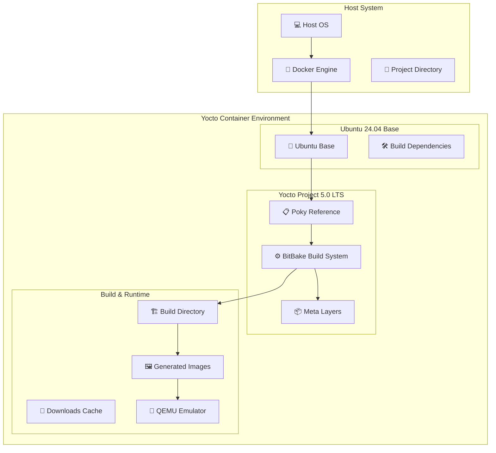
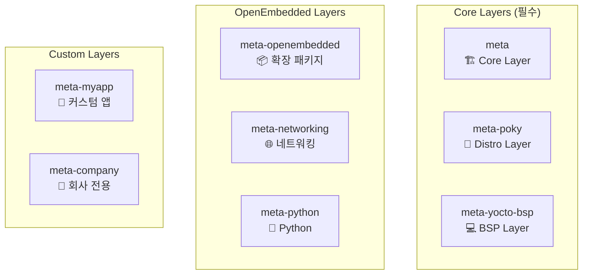
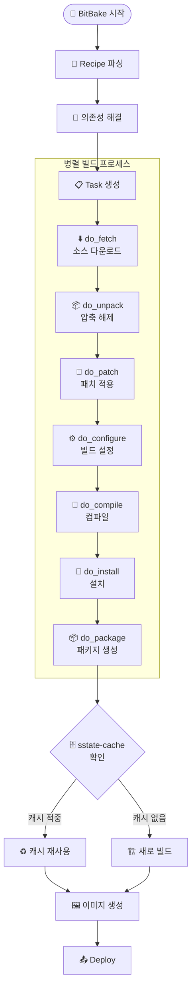

# Yocto 기본 구조 및 아키텍처

## Yocto Project 개념적 이해

### 핵심 철학

Yocto Project는 **"Create a custom Linux distribution for any hardware"**라는 목표를 가지고 설계되었습니다. 전통적인 Linux 배포판과 달리, Yocto는 **빌드 시스템 접근 방식**을 택했습니다:

| 구분 | 전통적인 배포판 | Yocto Project |
|------|----------------|---------------|
| 접근 방법 | 미리 빌드된 패키지 | 소스에서 빌드 |
| 패키지 관리 | APT, YUM 등 | 레시피 기반 |
| 커스터마이징 | 제한적 | 완전한 제어 |
| 크기 최적화 | 어려움 | 필요한 것만 포함 |
| 크로스 컴파일 | 복잡함 | 자동 지원 |

### 핵심 구성 요소

=== "BitBake (빌드 도구)"
    **Yocto의 태스크 실행 엔진**
    
    - Python과 shell 스크립트로 작성된 레시피를 파싱
    - 의존성 기반 병렬 빌드 지원
    - 공유 상태 캐시(sstate-cache)로 빌드 시간 단축
    - 주요 명령어: `bitbake core-image-minimal`

=== "Poky (참조 배포판)"
    **Yocto Project의 참조 구현체**
    
    - OpenEmbedded-Core (OE-Core): 핵심 메타데이터
    - BitBake: 빌드 도구
    - 문서 및 개발 도구
    - 최소한의 Linux 배포판을 만들기 위한 기본 설정 제공

=== "OpenEmbedded (메타데이터 프레임워크)"
    **패키지 빌드를 위한 메타데이터 제공**
    
    - **레시피 (.bb)**: 개별 소프트웨어 패키지 빌드 방법 정의
    - **클래스 (.bbclass)**: 공통 빌드 로직 재사용
    - **설정 (.conf)**: 빌드 환경 및 정책 정의
    - **어펜드 (.bbappend)**: 기존 레시피 확장

## 시스템 아키텍처



## 레이어 모델의 이해

### 레이어의 목적과 장점

!!! success "레이어 모델의 장점"
    - ✅ **모듈성**: 기능별로 분리된 독립적인 구성
    - ✅ **재사용성**: 다른 프로젝트에서 레이어 재활용 가능
    - ✅ **유지보수**: 각 레이어별 독립적 업데이트
    - ✅ **협업**: 팀별 레이어 분담 개발

### 레이어 계층 구조



### 레이어 우선순위 시스템

```bash
BBFILE_PRIORITY_meta-custom = "10"
BBFILE_PRIORITY_meta-oe = "6" 
BBFILE_PRIORITY_meta = "5"
```

!!! tip "우선순위 규칙"
    - 높은 숫자 = 높은 우선순위
    - 같은 레시피가 여러 레이어에 있을 경우 우선순위가 높은 레이어의 레시피 사용

## 빌드 프로세스 심화

### BitBake 작업 흐름



### 주요 태스크 설명

| 태스크 | 목적 | 입력 | 출력 |
|--------|------|------|------|
| `do_fetch` | 소스 다운로드 | SRC_URI | DL_DIR/*.tar.gz |
| `do_unpack` | 압축 해제 | 다운로드된 파일 | WORKDIR/source |
| `do_patch` | 패치 적용 | 소스 + 패치 파일 | 패치된 소스 |
| `do_configure` | 빌드 설정 | 소스 | Makefile/CMake |
| `do_compile` | 컴파일 | 설정된 소스 | 바이너리 |
| `do_install` | 파일 설치 | 바이너리 | image/ 디렉토리 |
| `do_package` | 패키지 생성 | 설치된 파일 | .deb/.rpm 등 |

## 크로스 컴파일 툴체인

### 툴체인 구성 요소

!!! info "자동 생성되는 툴체인"
    - **gcc-cross**: 크로스 컴파일러
    - **binutils-cross**: 링커, 어셈블러 등 바이너리 도구  
    - **glibc**: 타겟용 C 라이브러리
    - **kernel-headers**: 커널 헤더 파일

### 타겟 아키텍처 예시

```bash
# ARM용 빌드 설정
MACHINE = "beaglebone-yocto"
TARGET_ARCH = "arm"
TUNE_FEATURES = "arm armv7a neon"
```

---

← [강의 소개](intro.md) | [빌드 환경 설정](setup.md) → 