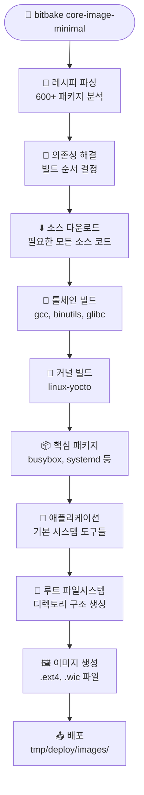

# 첫 빌드: 코어 이미지 및 빌드 프로세스

## Yocto 환경 초기화

컨테이너 내에서 Yocto 빌드 환경을 초기화합니다:

```bash
# Yocto 빌드 환경 초기화
source /opt/poky/oe-init-build-env /workspace/build

# 또는 편의 함수 사용
yocto_init
```

!!! info "환경 초기화가 하는 일"
    - BitBake 경로 설정
    - 빌드 디렉토리 생성 (`/workspace/build`)
    - 기본 설정 파일 생성 (`local.conf`, `bblayers.conf`)
    - 쉘 환경 변수 설정

## 빌드 설정 확인

### local.conf 주요 설정

```bash
# 현재 설정 확인
cat conf/local.conf | grep -E "(MACHINE|IMAGE_INSTALL|BB_NUMBER)"

# 주요 설정 예시
MACHINE ?= "qemux86-64"
BB_NUMBER_THREADS ?= "4"
PARALLEL_MAKE ?= "-j 4"
```

!!! tip "중요한 설정 변수들"
    - **MACHINE**: 타겟 하드웨어 (qemux86-64, beaglebone, raspberrypi4 등)
    - **BB_NUMBER_THREADS**: BitBake 병렬 태스크 수
    - **PARALLEL_MAKE**: 컴파일 병렬 작업 수
    - **DL_DIR**: 소스 다운로드 디렉토리
    - **SSTATE_DIR**: 공유 상태 캐시 디렉토리

### bblayers.conf 확인

```bash
# 레이어 구성 확인
cat conf/bblayers.conf

# 사용 가능한 레이어 목록
bitbake-layers show-layers
```

## 첫 번째 빌드 실행

### core-image-minimal 빌드

```bash
# 첫 빌드 시작 (약 30분-3시간 소요)
bitbake core-image-minimal

# 또는 편의 함수 사용
yocto_quick_build
```

!!! warning "빌드 시간"
    - **첫 빌드**: 30분에서 3시간까지 소요 (시스템 사양에 따라)
    - **이후 빌드**: 캐시 활용으로 5-30분 내외
    - **증분 빌드**: 변경사항만 빌드하므로 수분 내

### 빌드 과정 상세 분석



### 빌드 과정 모니터링

```bash
# 빌드 로그 실시간 확인
tail -f tmp/log/cooker/console-latest.log

# 현재 빌드 중인 패키지 확인
ps aux | grep bitbake

# 의존성 그래프 생성 (분석용)
bitbake -g core-image-minimal
```

### 빌드 진행 상황 이해

!!! example "빌드 단계별 설명"
    **1단계: 파싱 (Parsing)**
    ```
    Loading cache: 100% |#######| Time: 0:00:01
    Loaded 1234 entries from dependency cache.
    Parsing recipes: 100% |####| Time: 0:00:30
    ```
    
    **2단계: 의존성 해결**
    ```
    Computing transaction... done
    Generating task queue... done
    ```
    
    **3단계: 실행**
    ```
    Executing task 1234 of 5678 (ID: 1, /path/to/recipe.bb:do_fetch)
    ```

## 빌드 결과 확인

### 생성된 파일들

```bash
# 이미지 파일 위치
ls -la tmp/deploy/images/qemux86-64/

# 주요 파일들
# - core-image-minimal-qemux86-64.ext4 (루트 파일시스템)
# - bzImage (커널 이미지)
# - modules-qemux86-64.tgz (커널 모듈)
```

### 주요 출력물 설명

| 파일 | 설명 | 용도 |
|------|------|------|
| `*.ext4` | 루트 파일시스템 | QEMU에서 직접 부팅 |
| `*.tar.bz2` | 압축된 루트 파일시스템 | 배포, 분석용 |
| `*.wic` | 부팅 가능한 디스크 이미지 | 실제 하드웨어 플래싱 |
| `*.manifest` | 포함된 패키지 목록 | 문서화, 분석용 |

### 빌드 통계 확인

```bash
# 빌드 시간 확인
bitbake -e core-image-minimal | grep "^DATETIME"

# 빌드된 패키지 수 확인
find tmp/deploy/ipk/ -name "*.ipk" | wc -l

# 이미지 크기 확인
ls -lh tmp/deploy/images/qemux86-64/*.ext4
```

## 빌드 캐시 이해

### sstate-cache 활용

!!! success "sstate-cache의 장점"
    - 🚀 **빌드 속도 향상**: 이미 빌드된 결과를 재사용
    - 💾 **저장 공간 효율**: 해시 기반 중복 제거
    - 🔄 **증분 빌드**: 변경된 부분만 다시 빌드

```bash
# 캐시 상태 확인
ls -la sstate-cache/

# 캐시 통계
du -sh sstate-cache/
```

### 빌드 최적화 팁

```bash
# 1. 병렬 빌드 최적화
echo 'BB_NUMBER_THREADS = "8"' >> conf/local.conf
echo 'PARALLEL_MAKE = "-j 8"' >> conf/local.conf

# 2. 네트워크 캐시 활용
echo 'SSTATE_MIRRORS = "file://.* http://sstate.yoctoproject.org/PATH"' >> conf/local.conf

# 3. 불필요한 기능 비활성화
echo 'PACKAGECONFIG:remove:pn-qemu = "gtk+ sdl"' >> conf/local.conf
```

## 일반적인 빌드 문제 해결

### 디스크 공간 부족

```bash
# 빌드 임시 파일 정리
rm -rf tmp/

# 오래된 sstate 파일 정리
find sstate-cache/ -atime +30 -delete
```

### 네트워크 문제

```bash
# 다운로드 재시도
bitbake -c cleanall core-image-minimal
bitbake core-image-minimal
```

### 패키지 빌드 실패

```bash
# 특정 패키지 재빌드
bitbake -c clean <package-name>
bitbake <package-name>

# 로그 확인
less tmp/work/*/*/<package-name>*/temp/log.do_compile
```

---

← [환경 설정](setup.md) | [이미지 실행](run-image.md) → 