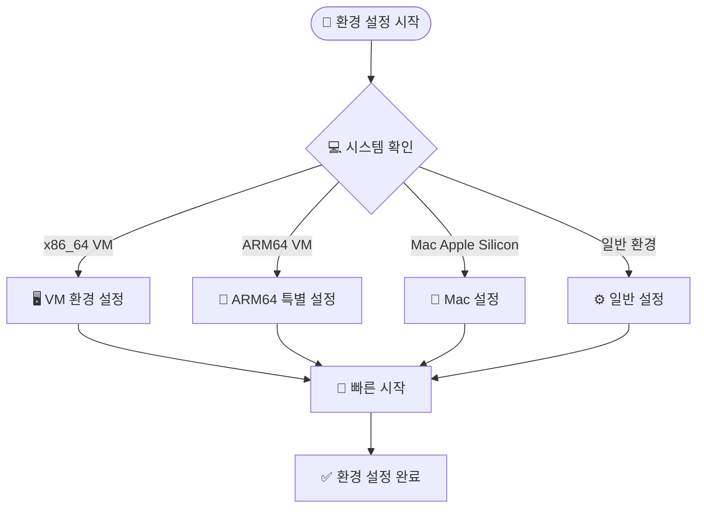

# Yocto 빌드 환경 설정

!!! tip "Docker 기반 환경"
    이 강의에서는 Docker를 사용하여 일관된 개발 환경을 제공합니다.

## 시스템 요구사항

### 최소 요구사항

!!! warning "시스템 사양"
    - **CPU**: 4코어 이상 (권장: 8코어)
    - **RAM**: 8GB 이상 (권장: 16GB)
    - **Storage**: 50GB 여유 공간
    - **Docker**: 20.10 이상

### 지원 플랫폼

- ✅ x86_64 (Intel/AMD)
- ✅ ARM64 (Apple Silicon)
- ✅ Virtual Machines

## Docker 환경 설정 실습

### 빠른 시작

```bash
# 프로젝트 클론
git clone https://github.com/jayleekr/kea-yocto.git
cd kea-yocto

# 시스템 상태 사전 확인 (권장)
./scripts/quick-start.sh --dry-run

# Docker 환경 시작
./scripts/quick-start.sh
```

### 단계별 설정 과정



### 컨테이너 진입 확인

```bash
# 컨테이너 내부에서 실행
whoami  # yocto 사용자 확인
pwd     # /workspace 디렉토리 확인
ls -la  # 파일 구조 확인
```

## 환경 최적화

### 빌드 시간 최적화 전략

| 방법 | 첫 빌드 시간 | 이후 빌드 | 설정 난이도 |
|------|-------------|-----------|------------|
| 기본 방식 | 2-3시간 | 30분 | 쉬움 |
| **웹 캐시** | **30분** | **10분** | **쉬움** ⭐ |
| CDN 캐시 | 15분 | 5분 | 보통 |

### 메모리 최적화 설정

```bash
# local.conf에 추가할 설정들
echo 'BB_NUMBER_THREADS = "4"' >> conf/local.conf
echo 'PARALLEL_MAKE = "-j 4"' >> conf/local.conf
```

### Docker 리소스 설정

!!! tip "Docker Desktop 설정"
    **macOS/Windows Docker Desktop에서:**
    
    1. Docker Desktop → Settings → Resources
    2. **Memory**: 최소 8GB 할당
    3. **CPUs**: 가능한 많이 할당 (4코어 이상)
    4. **Disk image size**: 최소 100GB

### 네트워크 최적화

```bash
# 빠른 미러 서버 사용
echo 'MIRRORS += "git://.*/.* http://downloads.yoctoproject.org/mirror/sources/"' >> conf/local.conf
echo 'MIRRORS += "ftp://.*/.* http://downloads.yoctoproject.org/mirror/sources/"' >> conf/local.conf
echo 'MIRRORS += "http://.*/.* http://downloads.yoctoproject.org/mirror/sources/"' >> conf/local.conf
echo 'MIRRORS += "https://.*/.* http://downloads.yoctoproject.org/mirror/sources/"' >> conf/local.conf
```

## 환경 변수 설정

### 중요한 환경 변수

```bash
# 빌드 디렉토리
BUILDDIR="/workspace/build"

# 다운로드 디렉토리 (공유 가능)
DL_DIR="/workspace/downloads"

# 상태 캐시 디렉토리 (공유 가능)  
SSTATE_DIR="/workspace/sstate-cache"

# 임시 디렉토리
TMPDIR="/workspace/build/tmp"
```

### 편의 함수 활용

```bash
# Yocto 환경 초기화
yocto_init() {
    source /opt/poky/oe-init-build-env /workspace/build
}

# 빠른 빌드
yocto_quick_build() {
    bitbake core-image-minimal
}

# 캐시 정리
yocto_clean() {
    rm -rf /workspace/build/tmp
}
```

## 트러블슈팅

### 일반적인 문제들

!!! danger "디스크 공간 부족"
    **증상**: 빌드 중 "No space left on device" 에러
    
    **해결책**:
    ```bash
    # 불필요한 파일 정리
    docker system prune -f
    
    # 빌드 임시 파일 정리
    rm -rf /workspace/build/tmp
    ```

!!! warning "메모리 부족"
    **증상**: 빌드가 멈추거나 시스템이 느려짐
    
    **해결책**:
    ```bash
    # 병렬 빌드 수 조정
    echo 'BB_NUMBER_THREADS = "2"' >> conf/local.conf
    echo 'PARALLEL_MAKE = "-j 2"' >> conf/local.conf
    ```

!!! info "네트워크 연결 문제"
    **증상**: 소스 다운로드 실패
    
    **해결책**:
    ```bash
    # 재시도 설정 추가
    echo 'BB_FETCH_PREMIRRORONLY = "0"' >> conf/local.conf
    echo 'BB_NO_NETWORK = "0"' >> conf/local.conf
    ```

### 환경 초기화

```bash
# 완전한 환경 리셋
docker compose down
docker compose up -d
docker compose exec yocto-lecture bash
```

### Docker 컨테이너 권한 문제 해결

!!! danger "Permission Denied 에러"
    **증상**: `/workspace/build` 디렉토리 생성 시 "Permission denied" 에러
    
    **원인**: Docker 컨테이너의 `/workspace` 디렉토리가 root 소유로 설정됨
    
    **해결책**:
    ```bash
    # 컨테이너 내부에서 실행
    docker compose exec yocto-lecture bash
    
    # 워크스페이스 권한 수정
    sudo chown -R yocto:yocto /workspace
    
    # 또는 컨테이너 외부에서 한 번에 실행
    docker compose exec yocto-lecture sudo chown -R yocto:yocto /workspace
    ```

!!! tip "자동화된 권한 수정"
    매번 수동으로 권한을 수정하는 것을 피하려면:
    ```bash
    # 컨테이너 시작 시 자동으로 권한 수정
    docker compose exec yocto-lecture bash -c "sudo chown -R yocto:yocto /workspace && bash"
    ```

---

← [아키텍처](architecture.md) | [첫 빌드](first-build.md) → 