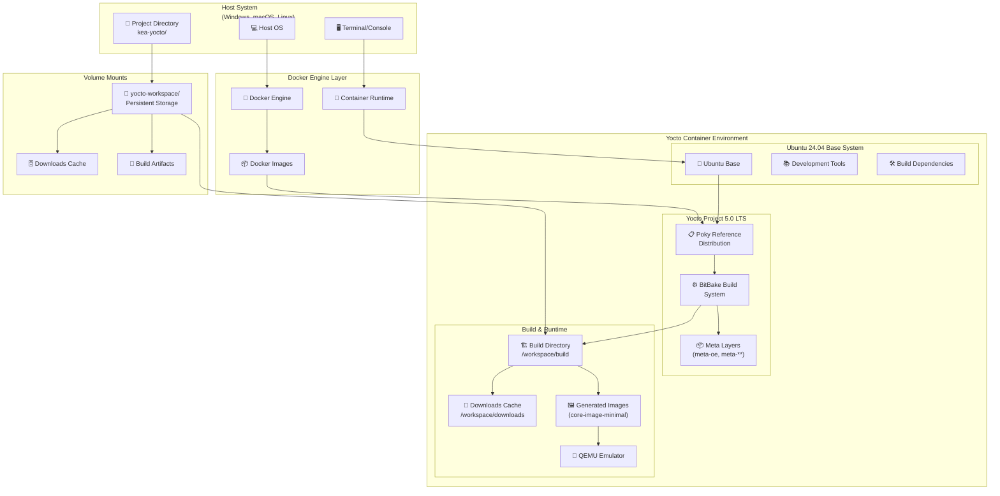
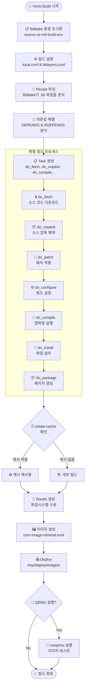
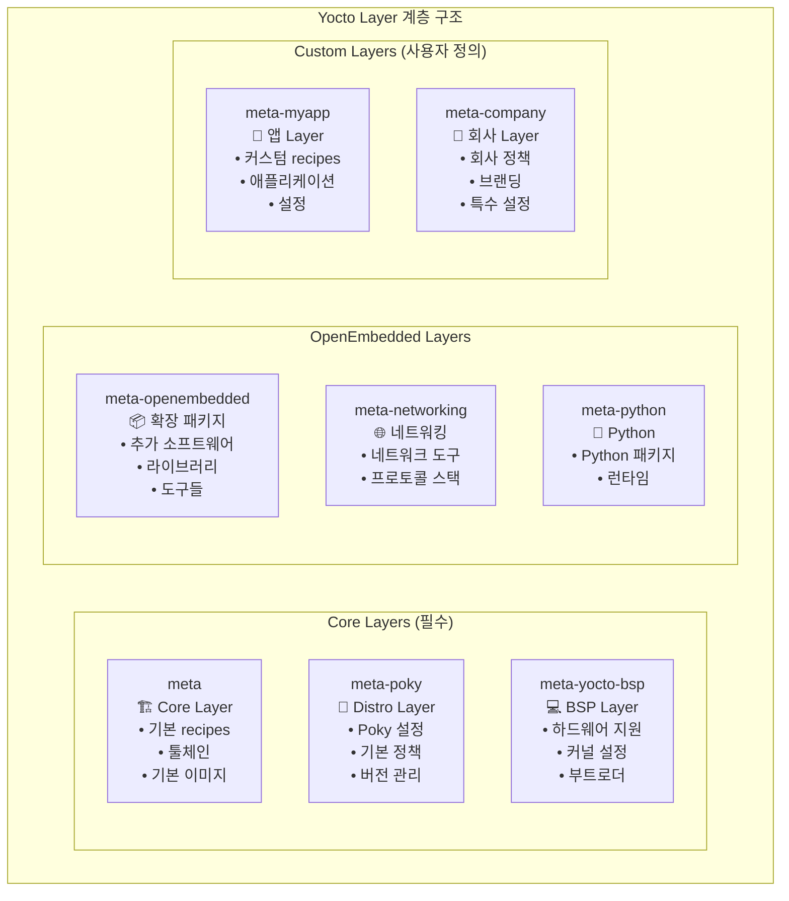
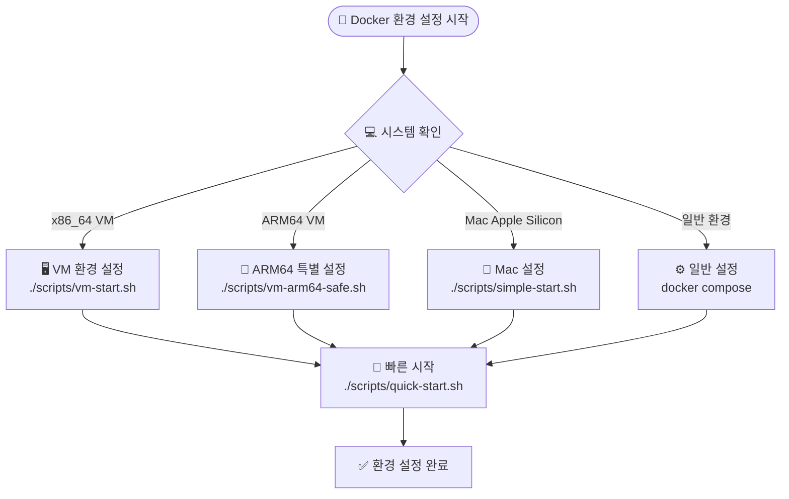

# KEA Yocto Project 5.0 LTS 강의 자료

**강의명**: Yocto Project를 활용한 임베디드 리눅스 시스템 개발  
**대상**: 임베디드 시스템 개발자, 리눅스 시스템 엔지니어  
**시간**: 8시간 (휴식 포함)  
**환경**: Docker 기반 Yocto 5.0 LTS (Scarthgap)  

---

## 📋 강의 목차

| 시간 | 내용 | 유형 | 비고 |
|------|------|------|------|
| 09:00-09:30 | [강의 소개 및 개요](#1-강의-소개-및-개요) | 이론 | 30분 |
| 09:30-10:30 | [Yocto 기본 구조 및 아키텍처](#2-yocto-기본-구조-및-아키텍처) | 이론 | 60분 |
| 10:45-11:30 | [Yocto 빌드 환경 설정](#3-yocto-빌드-환경-설정) | 실습 | 45분 |
| 11:30-12:30 | [첫 빌드: 코어 이미지 및 빌드 프로세스](#4-첫-빌드-코어-이미지-및-빌드-프로세스) | 실습+이론 | 60분 |
| 13:30-14:00 | [빌드된 이미지 실행하기](#5-빌드된-이미지-실행하기) | 실습 | 30분 |
| 14:00-14:30 | [이미지 커스터마이징: 패키지 추가](#6-이미지-커스터마이징-패키지-추가) | 실습 | 30분 |
| 14:45-16:00 | [커스텀 레이어 및 레시피 생성](#7-커스텀-레이어-및-레시피-생성) | 실습 | 75분 |
| 16:00-16:30 | [Yocto 고급 주제 개요](#8-yocto-고급-주제-개요) | 이론 | 30분 |
| 16:30-17:00 | [마무리 및 Q&A](#9-마무리-및-qa) | 토론 | 30분 |

---

## 1. 강의 소개 및 개요

### 1.1 Yocto Project란?

**Yocto Project**는 임베디드 리눅스 배포판을 만들기 위한 오픈소스 프로젝트입니다.

#### 핵심 특징
- 📦 **커스텀 리눅스 배포판** 생성
- 🔧 **크로스 컴파일 툴체인** 자동 생성
- 📚 **레시피 기반** 패키지 관리
- 🎯 **타겟 하드웨어** 최적화

#### 주요 구성 요소
- **Poky**: Yocto의 참조 배포판
- **BitBake**: 빌드 도구 및 태스크 실행기
- **OpenEmbedded**: 메타데이터 및 레시피 저장소

### 1.2 강의 목표

이 강의를 통해 다음을 학습합니다:

✅ Yocto Project의 기본 개념과 아키텍처 이해  
✅ Docker 환경에서 Yocto 빌드 환경 구축  
✅ 커스텀 리눅스 이미지 생성 및 실행  
✅ 패키지 추가 및 이미지 커스터마이징  
✅ 커스텀 레이어와 레시피 작성  
✅ 실제 프로젝트 적용 가능한 실무 지식 습득  

---

## 2. Yocto 기본 구조 및 아키텍처

### 2.1 시스템 아키텍처

Yocto 시스템은 다음과 같은 계층 구조로 이루어져 있습니다:



### 2.2 빌드 프로세스

Yocto의 빌드 프로세스는 다음과 같은 단계로 진행됩니다:



### 2.3 레이어 구조

Yocto는 레이어 기반 아키텍처를 사용합니다:



---

## 3. Yocto 빌드 환경 설정

### 3.1 시스템 요구사항

#### 최소 요구사항
- **CPU**: 4코어 이상
- **RAM**: 8GB (권장 16GB)
- **Storage**: 50GB 여유 공간
- **Docker**: 20.10 이상

#### 지원 플랫폼
- ✅ x86_64 (Intel/AMD)
- ✅ ARM64 (Apple Silicon)
- ✅ Virtual Machines

### 3.2 Docker 환경 설정 실습

Docker 환경 설정 과정을 따라해보겠습니다:



#### 실습 단계

**1단계: 프로젝트 다운로드**
```bash
git clone https://github.com/jayleekr/kea-yocto.git
cd kea-yocto
```

**2단계: 빠른 시작**
```bash
# 시스템 상태 사전 확인 (권장)
./scripts/quick-start.sh --dry-run

# 실제 환경 설정 및 실행
./scripts/quick-start.sh
```

**3단계: 컨테이너 진입 확인**
```bash
# 컨테이너 내부에서 실행
whoami  # yocto 사용자 확인
pwd     # /workspace 디렉토리 확인
ls -la  # 파일 구조 확인
```

### 3.3 환경 최적화

#### 빌드 시간 최적화 전략

| 방법 | 첫 빌드 시간 | 이후 빌드 | 설정 난이도 |
|------|-------------|-----------|------------|
| 기본 방식 | 2-3시간 | 30분 | 쉬움 |
| **웹 캐시** | **30분** | **10분** | **쉬움** ⭐ |
| CDN 캐시 | 15분 | 5분 | 보통 |

#### 메모리 최적화 설정
```bash
# local.conf에 추가할 설정들
echo 'BB_NUMBER_THREADS = "4"' >> conf/local.conf
echo 'PARALLEL_MAKE = "-j 4"' >> conf/local.conf
```

---

## 4. 첫 빌드: 코어 이미지 및 빌드 프로세스

### 4.1 Yocto 환경 초기화

컨테이너 내에서 Yocto 빌드 환경을 초기화합니다:

```bash
# Yocto 빌드 환경 초기화
source /opt/poky/oe-init-build-env /workspace/build

# 또는 편의 함수 사용
yocto_init
```

### 4.2 빌드 설정 확인

#### local.conf 주요 설정
```bash
# 현재 설정 확인
cat conf/local.conf | grep -E "(MACHINE|IMAGE_INSTALL|BB_NUMBER)"

# 주요 설정 예시
MACHINE ?= "qemux86-64"
BB_NUMBER_THREADS ?= "4"
PARALLEL_MAKE ?= "-j 4"
```

#### bblayers.conf 확인
```bash
# 레이어 구성 확인
cat conf/bblayers.conf

# 사용 가능한 레이어 목록
bitbake-layers show-layers
```

### 4.3 첫 번째 빌드 실행

#### core-image-minimal 빌드
```bash
# 첫 빌드 시작 (약 30분-3시간 소요)
bitbake core-image-minimal

# 또는 편의 함수 사용
yocto_quick_build
```

#### 빌드 과정 모니터링
```bash
# 빌드 로그 확인
tail -f tmp/log/cooker/console-latest.log

# 진행 상황 확인
bitbake -g core-image-minimal
```

### 4.4 빌드 결과 확인

```bash
# 생성된 이미지 위치
ls -la tmp/deploy/images/qemux86-64/

# 주요 파일들
# - core-image-minimal-qemux86-64.ext4 (루트 파일시스템)
# - bzImage (커널 이미지)
# - bootx64.efi (부트로더)
```

---

## 5. 빌드된 이미지 실행하기

### 5.1 QEMU를 사용한 이미지 실행

```bash
# QEMU에서 이미지 실행
runqemu qemux86-64 core-image-minimal

# 네트워크 포함 실행
runqemu qemux86-64 core-image-minimal slirp

# 그래픽 인터페이스로 실행
runqemu qemux86-64 core-image-minimal nographic
```

### 5.2 가상 머신 내부 탐색

QEMU가 실행되면 다음을 확인해보세요:

```bash
# 시스템 정보 확인
uname -a
cat /etc/os-release

# 설치된 패키지 확인
opkg list-installed

# 디스크 사용량 확인
df -h

# 메모리 사용량 확인
free -h

# 프로세스 확인
ps aux
```

### 5.3 네트워크 및 연결 테스트

```bash
# 네트워크 인터페이스 확인
ip addr show

# 인터넷 연결 테스트 (슬립 모드에서)
ping -c 3 8.8.8.8

# SSH 접속 가능 확인 (다른 터미널에서)
ssh -p 2222 root@localhost
```

### 5.4 QEMU 종료

```bash
# QEMU 내부에서 종료
poweroff

# 또는 강제 종료 (호스트에서)
Ctrl+A, X
```

---

## 6. 이미지 커스터마이징: 패키지 추가

### 6.1 local.conf를 통한 패키지 추가

기본 이미지에 추가 패키지를 포함시켜보겠습니다:

```bash
# local.conf 파일 편집
vi conf/local.conf

# 다음 라인 추가
IMAGE_INSTALL:append = " nano vim htop git"
IMAGE_INSTALL:append = " python3 python3-pip"
IMAGE_INSTALL:append = " openssh-server dropbear"
```

### 6.2 재빌드 및 확인

```bash
# 수정된 설정으로 재빌드
bitbake core-image-minimal

# 새 이미지로 실행
runqemu qemux86-64 core-image-minimal

# 추가된 패키지 확인
which nano vim htop git python3
python3 --version
```

### 6.3 고급 이미지 커스터마이징

#### 이미지 크기 최적화
```bash
# local.conf에 추가
IMAGE_FEATURES += "read-only-rootfs"
IMAGE_FEATURES += "package-management"
EXTRA_IMAGE_FEATURES = "debug-tweaks"
```

#### 커널 모듈 추가
```bash
# 특정 커널 모듈 포함
IMAGE_INSTALL:append = " kernel-modules"

# 개발 도구 추가
IMAGE_INSTALL:append = " packagegroup-core-buildessential"
```

### 6.4 패키지 검색 및 정보 확인

```bash
# 사용 가능한 패키지 검색
bitbake -s | grep python

# 패키지 정보 확인
bitbake -e python3 | grep ^DESCRIPTION

# 패키지 의존성 확인
bitbake -g python3
```

---

## 7. 커스텀 레이어 및 레시피 생성

### 7.1 새 레이어 생성

커스텀 애플리케이션을 위한 새 레이어를 생성해보겠습니다:

```bash
# 새 레이어 생성
bitbake-layers create-layer ../meta-myapp

# 생성된 레이어 구조 확인
tree ../meta-myapp

# 레이어를 빌드에 추가
bitbake-layers add-layer ../meta-myapp

# 레이어 목록 확인
bitbake-layers show-layers
```

### 7.2 간단한 애플리케이션 레시피 작성

#### Hello World C 프로그램 생성

```bash
# 소스 코드 디렉토리 생성
mkdir -p ../meta-myapp/recipes-myapp/hello-world/files

# C 소스 코드 작성
cat > ../meta-myapp/recipes-myapp/hello-world/files/hello.c << 'EOF'
#include <stdio.h>

int main() {
    printf("Hello from Yocto Custom Layer!\n");
    printf("This is my first custom application.\n");
    return 0;
}
EOF

# Makefile 작성
cat > ../meta-myapp/recipes-myapp/hello-world/files/Makefile << 'EOF'
CC ?= gcc
CFLAGS ?= -Wall -O2

TARGET = hello
SOURCE = hello.c

$(TARGET): $(SOURCE)
	$(CC) $(CFLAGS) -o $(TARGET) $(SOURCE)

install:
	install -d $(DESTDIR)/usr/bin
	install -m 755 $(TARGET) $(DESTDIR)/usr/bin/

clean:
	rm -f $(TARGET)

.PHONY: install clean
EOF
```

#### 레시피 파일 작성

```bash
# 레시피 파일 생성
cat > ../meta-myapp/recipes-myapp/hello-world/hello-world_1.0.bb << 'EOF'
SUMMARY = "Hello World application for Yocto"
DESCRIPTION = "A simple Hello World C application demonstrating custom layer creation"
LICENSE = "MIT"
LIC_FILES_CHKSUM = "file://${COMMON_LICENSE_DIR}/MIT;md5=0835ade698e0bcf8506ecda2f7b4f302"

SRC_URI = "file://hello.c \
           file://Makefile"

S = "${WORKDIR}"

do_compile() {
    oe_runmake
}

do_install() {
    oe_runmake install DESTDIR=${D}
}
EOF
```

### 7.3 레시피 빌드 및 테스트

```bash
# 레시피만 빌드
bitbake hello-world

# 생성된 패키지 확인
find tmp/deploy -name "*hello-world*"

# 이미지에 포함시키기
echo 'IMAGE_INSTALL:append = " hello-world"' >> conf/local.conf

# 전체 이미지 재빌드
bitbake core-image-minimal
```

### 7.4 커스텀 이미지 레시피 생성

```bash
# 커스텀 이미지 레시피 생성
mkdir -p ../meta-myapp/recipes-core/images

cat > ../meta-myapp/recipes-core/images/my-custom-image.bb << 'EOF'
SUMMARY = "My custom image with additional tools"
LICENSE = "MIT"

inherit core-image

IMAGE_FEATURES += "ssh-server-openssh package-management"

IMAGE_INSTALL = "packagegroup-core-boot \
                 packagegroup-base-extended \
                 hello-world \
                 nano \
                 vim \
                 htop \
                 git \
                 python3 \
                 python3-pip \
                 ${CORE_IMAGE_EXTRA_INSTALL}"

export IMAGE_BASENAME = "my-custom-image"
EOF

# 커스텀 이미지 빌드
bitbake my-custom-image
```

### 7.5 고급 레시피 기능

#### 패치 적용
```bash
# 패치 파일 추가
mkdir -p ../meta-myapp/recipes-myapp/hello-world/files
cat > ../meta-myapp/recipes-myapp/hello-world/files/add-timestamp.patch << 'EOF'
--- a/hello.c
+++ b/hello.c
@@ -1,7 +1,9 @@
 #include <stdio.h>
+#include <time.h>
 
 int main() {
     printf("Hello from Yocto Custom Layer!\n");
     printf("This is my first custom application.\n");
+    printf("Built at: %s", __DATE__ " " __TIME__ "\n");
     return 0;
 }
EOF

# 레시피에 패치 추가
echo 'SRC_URI += "file://add-timestamp.patch"' >> ../meta-myapp/recipes-myapp/hello-world/hello-world_1.0.bb
```

---

## 8. Yocto 고급 주제 개요

### 8.1 개발 워크플로우 최적화

#### devtool 사용
```bash
# 개발용 워크스페이스 생성
devtool create-workspace ../workspace

# 기존 레시피 수정
devtool modify hello-world

# 변경사항 적용
devtool build hello-world

# 레시피에 변경사항 반영
devtool finish hello-world ../meta-myapp
```

#### 증분 빌드 활용
```bash
# 특정 태스크만 재실행
bitbake -c compile hello-world
bitbake -c install hello-world

# 캐시 상태 확인
bitbake-diffsigs tmp/stamps/*/hello-world/
```

### 8.2 배포 및 업데이트

#### 업데이트 시스템
- **SWUpdate**: 안전한 시스템 업데이트
- **Mender**: OTA(Over-The-Air) 업데이트
- **OSTree**: 원자적 업데이트

#### 이미지 형식
```bash
# 다양한 이미지 형식 생성
IMAGE_FSTYPES += "ext4 tar.gz wic"

# 압축 이미지
IMAGE_FSTYPES += "ext4.gz tar.bz2"

# SD 카드 이미지
IMAGE_FSTYPES += "wic.gz"
```

### 8.3 보안 및 최적화

#### 보안 강화
```bash
# 보안 기능 활성화
IMAGE_FEATURES += "read-only-rootfs"
EXTRA_IMAGE_FEATURES += "empty-root-password"

# SELinux 지원
DISTRO_FEATURES:append = " selinux"
```

#### 크기 최적화
```bash
# 불필요한 기능 제거
IMAGE_FEATURES:remove = "package-management"
DISTRO_FEATURES:remove = "x11"

# 언어 설정 최적화
IMAGE_LINGUAS = "ko"
```

### 8.4 멀티플랫폼 지원

#### 다중 머신 설정
```bash
# ARM 타겟 빌드
MACHINE = "qemuarm64"
bitbake core-image-minimal

# 라즈베리파이 지원
MACHINE = "raspberrypi4"
bitbake core-image-minimal
```

#### 교차 컴파일 SDK
```bash
# SDK 생성
bitbake core-image-minimal -c populate_sdk

# 생성된 SDK 설치
./tmp/deploy/sdk/poky-glibc-x86_64-core-image-minimal-cortexa57-qemuarm64-toolchain-5.0.sh
```

---

## 9. 마무리 및 Q&A

### 9.1 강의 요약

오늘 강의에서 다룬 내용:

✅ **Yocto Project 기본 개념** 이해  
✅ **Docker 기반 개발 환경** 구축  
✅ **첫 번째 리눅스 이미지** 빌드 및 실행  
✅ **패키지 추가 및 커스터마이징** 실습  
✅ **커스텀 레이어 및 레시피** 생성  
✅ **고급 주제** 개요 학습  

### 9.2 다음 단계 학습 방향

#### 추천 학습 경로
1. **실제 하드웨어 타겟팅** (라즈베리파이, BeagleBone 등)
2. **BSP(Board Support Package) 개발**
3. **멀티미디어 및 그래픽 스택** 통합
4. **실시간 시스템** 구성
5. **보안 강화** 및 **업데이트 시스템** 구축

#### 유용한 리소스
- 📚 [Yocto Project 공식 문서](https://docs.yoctoproject.org/)
- 🌐 [OpenEmbedded Layer Index](https://layers.openembedded.org/)
- 💬 [Yocto Project 메일링 리스트](https://lists.yoctoproject.org/)
- 🐛 [Bugzilla 이슈 트래커](https://bugzilla.yoctoproject.org/)

### 9.3 실습 환경 유지

강의 후에도 계속 학습하실 수 있도록:

```bash
# 컨테이너 중지 (데이터는 보존됨)
docker compose down

# 나중에 다시 시작
docker compose run --rm yocto-lecture

# 빌드 캐시 확인
ls -la yocto-workspace/
```

### 9.4 Q&A 세션

**자주 묻는 질문들:**

**Q: 빌드 시간을 더 줄일 수 있는 방법은?**
A: sstate-cache와 DL_DIR을 공유하고, BB_NUMBER_THREADS와 PARALLEL_MAKE를 시스템에 맞게 조정하세요.

**Q: 상용 제품에 Yocto를 적용할 때 주의사항은?**
A: 라이선스 관리, 보안 업데이트 계획, 장기 지원(LTS) 버전 사용을 고려하세요.

**Q: 기존 패키지를 Yocto에 포팅하는 방법은?**
A: recipetool을 사용하여 자동 생성하거나, devtool을 활용한 점진적 개발을 추천합니다.

**Q: ARM64와 x86_64 동시 지원 방법은?**
A: MACHINE 변수를 통한 멀티플랫폼 설정과 교차 컴파일 툴체인을 활용하세요.

---

## 📚 부록

### A.1 유용한 BitBake 명령어

```bash
# 레시피 검색
bitbake -s | grep <pattern>

# 레시피 정보 확인
bitbake -e <recipe>

# 의존성 그래프 생성
bitbake -g <recipe>

# 특정 태스크 실행
bitbake -c <task> <recipe>

# 패키지 내용 확인
oe-pkgdata-util list-pkg-files <package>
```

### A.2 디버깅 팁

```bash
# 빌드 로그 확인
bitbake -v <recipe>

# 작업 디렉토리 확인
bitbake -c devshell <recipe>

# 패키지 의존성 문제 해결
bitbake -k <recipe>

# 캐시 정리
bitbake -c cleanall <recipe>
```

### A.3 성능 튜닝

```bash
# local.conf 최적화 설정
BB_NUMBER_THREADS = "8"
PARALLEL_MAKE = "-j 8"
BB_HASHBASE_WHITELIST:append = " BB_NUMBER_THREADS PARALLEL_MAKE"

# 디스크 I/O 최적화
SSTATE_DIR = "/fast-storage/sstate-cache"
DL_DIR = "/fast-storage/downloads"
```

---

**강의 자료 끝**

이 자료는 KEA Yocto Project 강의를 위해 제작되었습니다.  
문의사항이 있으시면 언제든지 질문해주세요! 🚀 