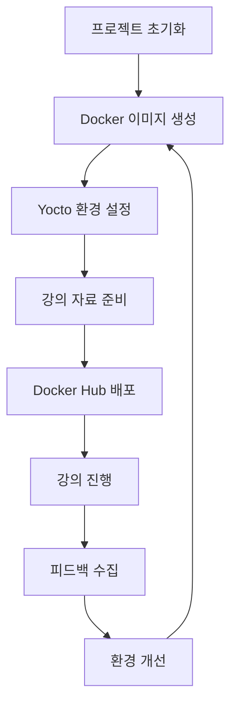

# Yocto 5.0 LTS 강의 환경 워크플로우

## 전체 워크플로우 개요



## 1. 개발 단계 워크플로우

### 1.1 프로젝트 초기화
```bash
# 1. 저장소 구조 생성
├── Dockerfile
├── docker-compose.yml
├── scripts/
│   ├── setup.sh
│   ├── build-env.sh
│   └── cleanup.sh
├── configs/
│   ├── local.conf.template
│   └── bblayers.conf.template
├── docs/
│   ├── yocto_lecture.md
│   ├── project_config.md
│   └── workflow.md
└── examples/
    ├── meta-myapp/
    └── helloworld_1.0.bb
```

### 1.2 Docker 이미지 생성 워크플로우
```bash
# Phase 1: Base 이미지 준비
1. Ubuntu 24.04 LTS 베이스 이미지 선택
2. 시스템 패키지 업데이트
3. Yocto 의존성 패키지 설치
4. 사용자 계정 및 권한 설정

# Phase 2: Yocto 환경 구성
1. Poky 5.0 저장소 클론
2. 빌드 환경 초기화 스크립트 준비
3. 설정 파일 템플릿 배치
4. QEMU 설정 및 테스트

# Phase 3: 최적화 및 검증
1. 불필요한 파일 정리
2. 이미지 크기 최적화
3. 기본 빌드 테스트 수행
4. 컨테이너 실행 검증
```

### 1.3 이미지 빌드 자동화
```bash
#!/bin/bash
# build-docker-image.sh

# 환경 변수 설정
export DOCKER_IMAGE_NAME="yocto-lecture"
export DOCKER_TAG="5.0-lts"
export DOCKERFILE_PATH="."

# 이미지 빌드
docker build \
    --build-arg UBUNTU_VERSION=24.04 \
    --build-arg YOCTO_VERSION=5.0 \
    --tag ${DOCKER_IMAGE_NAME}:${DOCKER_TAG} \
    ${DOCKERFILE_PATH}

# 빌드 검증
docker run --rm ${DOCKER_IMAGE_NAME}:${DOCKER_TAG} \
    /bin/bash -c "source /opt/poky/oe-init-build-env && bitbake-layers show-layers"
```

## 2. 강의 진행 워크플로우

### 2.1 강의 전 준비 (30분 전)
```bash
# 1. 참석자 환경 점검
- Docker 설치 확인
- 충분한 저장 공간 확인 (50GB+)
- 네트워크 연결 확인

# 2. 컨테이너 사전 실행
docker pull yocto-lecture:5.0-lts
docker run -it --name yocto-session yocto-lecture:5.0-lts

# 3. 실습 자료 확인
- 예제 코드 준비
- 트러블슈팅 가이드 준비
```

### 2.2 실시간 강의 워크플로우

#### Session 1: 환경 설정 (10:45 - 11:30)
```bash
# 1. 컨테이너 시작
docker run -it --privileged \
    -v ${PWD}/workspace:/workspace \
    --name yocto-build \
    yocto-lecture:5.0-lts

# 2. Yocto 환경 초기화
source /opt/poky/oe-init-build-env /workspace/build

# 3. 설정 파일 커스터마이징
# local.conf 편집: MACHINE, BB_NUMBER_THREADS, DL_DIR, SSTATE_DIR
```

#### Session 2: 첫 빌드 (11:30 - 12:30)
```bash
# 1. 빌드 시작 (백그라운드에서 실행)
bitbake core-image-minimal

# 2. 빌드 프로세스 설명 (병렬 진행)
- BitBake 작업 흐름
- 태스크 의존성
- sstate 캐시 활용
- 로그 모니터링

# 3. 빌드 완료 확인
ls tmp/deploy/images/qemux86-64/
```

#### Session 3: 이미지 실행 (13:30 - 14:00)
```bash
# 1. QEMU 실행
runqemu qemux86-64 core-image-minimal

# 2. 시스템 탐색
uname -a
cat /etc/os-release
busybox --help

# 3. 종료
poweroff
```

#### Session 4: 커스터마이징 (14:00 - 14:30)
```bash
# 1. 패키지 추가
echo 'IMAGE_INSTALL:append = " nano"' >> conf/local.conf

# 2. 증분 빌드
bitbake core-image-minimal

# 3. 검증
runqemu qemux86-64 core-image-minimal
# 컨테이너 내에서 nano 실행 확인
```

#### Session 5: 커스텀 레이어 (14:45 - 16:00)
```bash
# 1. 레이어 생성
bitbake-layers create-layer ../meta-myapp
bitbake-layers add-layer ../meta-myapp

# 2. 레시피 작성
# helloworld_1.0.bb 생성

# 3. 빌드 및 테스트
bitbake helloworld
bitbake core-image-minimal
```

### 2.3 문제 해결 워크플로우

#### 일반적인 빌드 오류
```bash
# 1. 디스크 공간 부족
df -h
docker system prune -a

# 2. 네트워크 연결 문제
ping -c 3 github.com
curl -I https://downloads.yoctoproject.org

# 3. 권한 문제
chown -R yocto:yocto /workspace
chmod -R 755 /workspace

# 4. BitBake 캐시 정리
bitbake -c cleanall core-image-minimal
rm -rf tmp sstate-cache
```

## 3. 배포 워크플로우

### 3.1 Docker Hub 배포
```bash
# 1. 이미지 태깅
docker tag yocto-lecture:5.0-lts username/yocto-lecture:5.0-lts
docker tag yocto-lecture:5.0-lts username/yocto-lecture:latest

# 2. Docker Hub 로그인
docker login

# 3. 이미지 푸시
docker push username/yocto-lecture:5.0-lts
docker push username/yocto-lecture:latest

# 4. 배포 검증
docker pull username/yocto-lecture:latest
docker run --rm username/yocto-lecture:latest bitbake --version
```

### 3.2 버전 관리
```bash
# Git 태깅
git tag -a v5.0.0 -m "Yocto 5.0 LTS lecture environment"
git push origin v5.0.0

# Docker 이미지 버전 태깅
docker tag yocto-lecture:5.0-lts yocto-lecture:v5.0.0
```

## 4. 모니터링 및 개선

### 4.1 성능 메트릭 수집
```bash
# 빌드 시간 측정
time bitbake core-image-minimal

# 리소스 사용량 모니터링
docker stats yocto-build

# 디스크 사용량 추적
du -sh tmp/ sstate-cache/ downloads/
```

### 4.2 피드백 루프
```bash
# 1. 강의 후 설문 수집
# 2. 성능 데이터 분석
# 3. 개선 사항 도출
# 4. 다음 버전 계획 수립
```

## 5. 자동화 스크립트 예시

### 5.1 전체 환경 설정 스크립트
```bash
#!/bin/bash
# quick-start.sh

set -e

echo "Yocto 5.0 LTS 강의 환경을 시작합니다..."

# Docker 컨테이너 실행
docker run -it --privileged \
    -v $(pwd)/workspace:/workspace \
    -v $(pwd)/downloads:/opt/yocto/downloads \
    -v $(pwd)/sstate-cache:/opt/yocto/sstate-cache \
    --name yocto-lecture-$(date +%Y%m%d) \
    yocto-lecture:5.0-lts
```

### 5.2 정리 스크립트
```bash
#!/bin/bash
# cleanup.sh

echo "강의 환경을 정리합니다..."

# 컨테이너 정지 및 제거
docker stop $(docker ps -q --filter ancestor=yocto-lecture:5.0-lts)
docker rm $(docker ps -aq --filter ancestor=yocto-lecture:5.0-lts)

# 임시 파일 정리 (선택적)
# docker system prune -f
```

이 워크플로우는 Yocto 강의의 모든 단계를 체계적으로 관리하고, 참석자들이 일관된 경험을 할 수 있도록 지원합니다. 